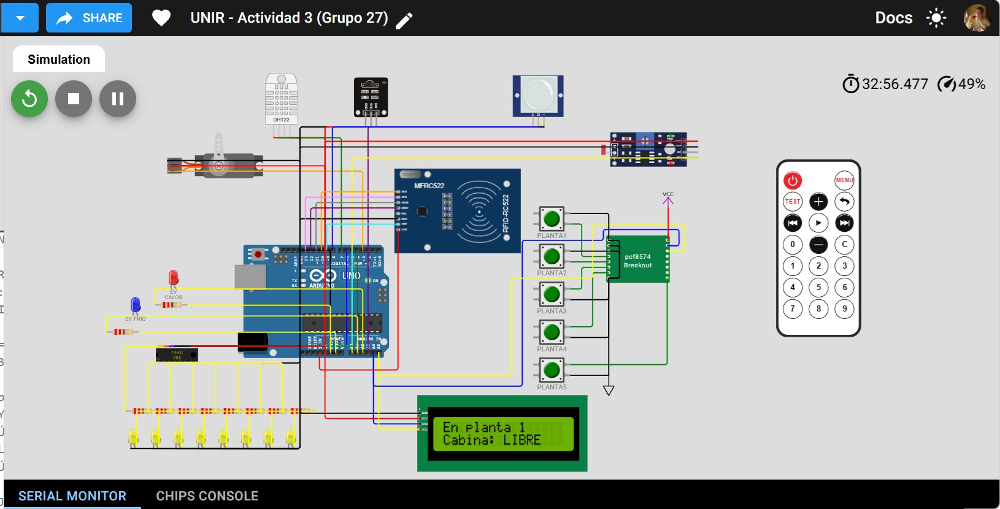
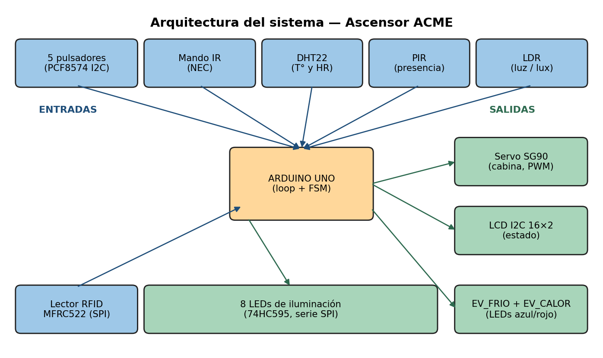
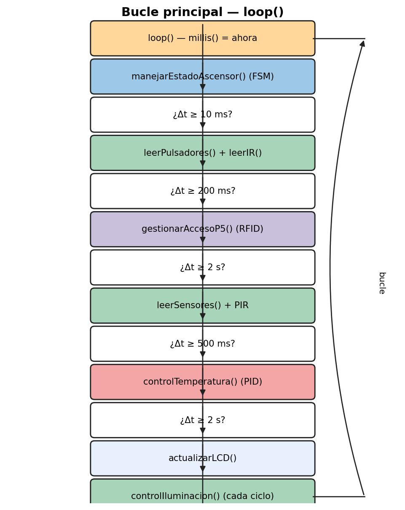
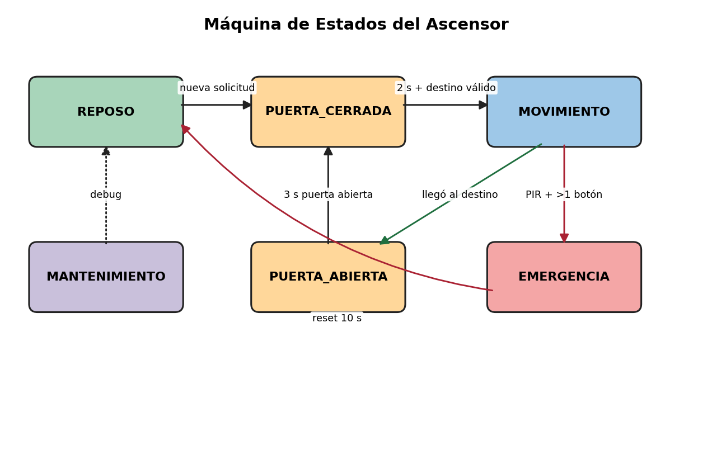
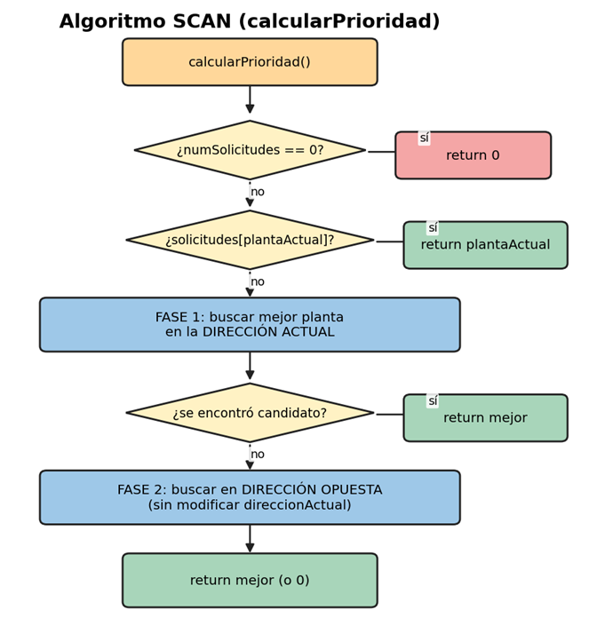
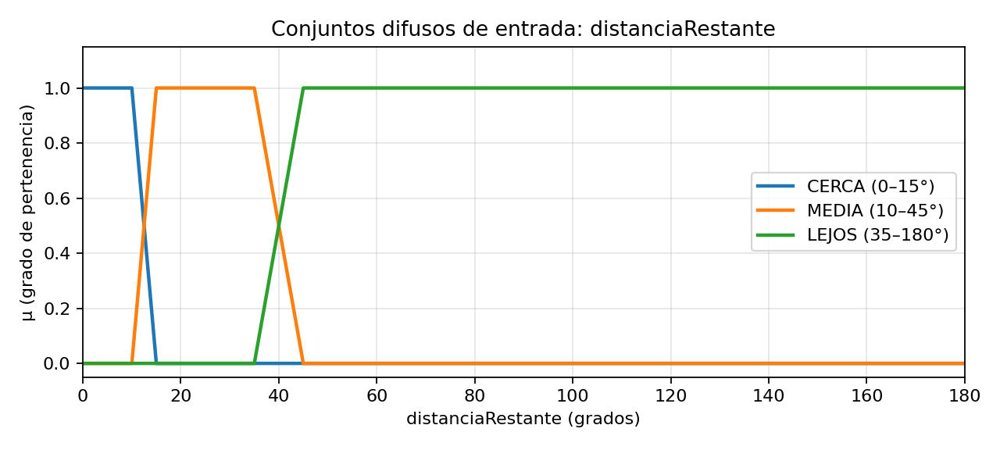
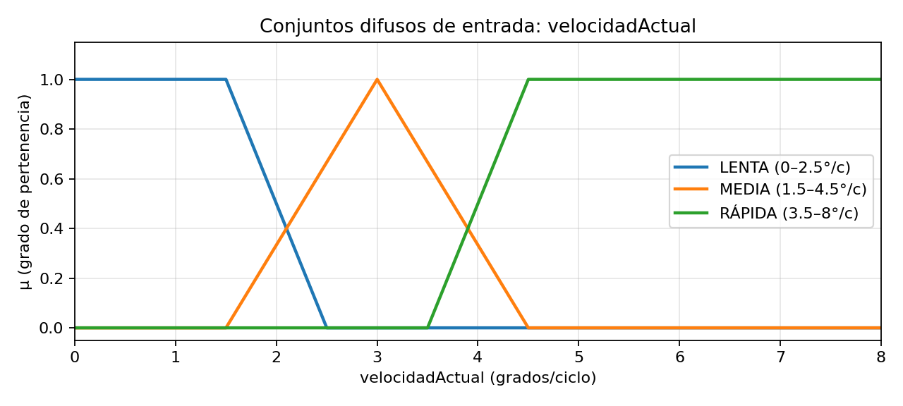
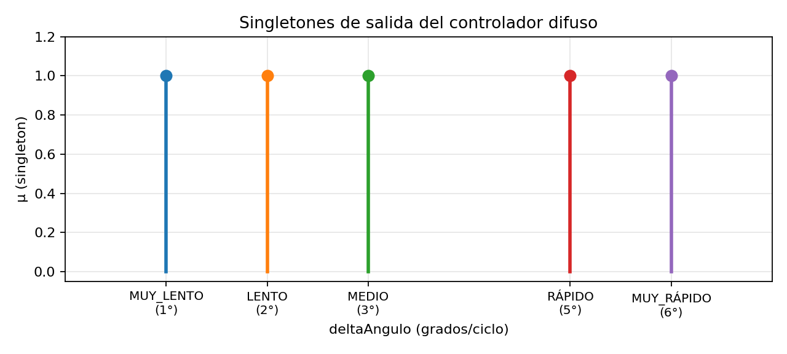
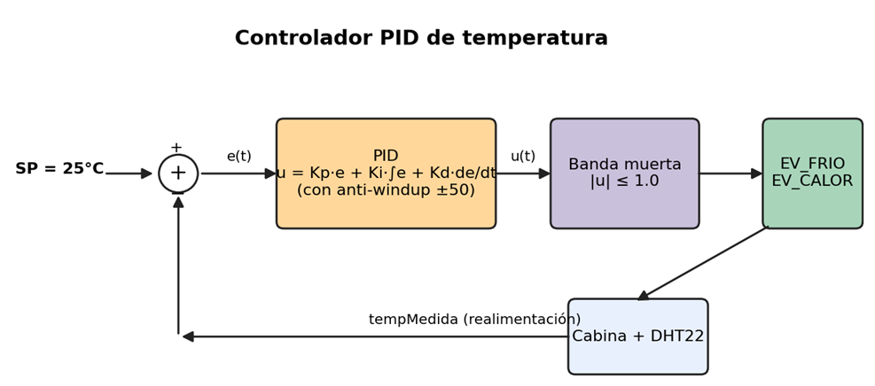

# UNIR---Actividad-3-Grupo-27-
# Ascensor Inteligente ACME S.A.

<p align="center">
  <br>
  <small><em>Figura 1. Montaje completo del prototipo en el entorno de simulación Wokwi.</em></small>
</p>

<p align="center">
  <strong>Equipos e Instrumentación Electrónica</strong> · MUIT 2026<br>
  Actividad 3 — Grupo 27<br>
  <em>Universidad Internacional de La Rioja (UNIR)</em>
</p>

<p align="center">
  
  
  
  
  
</p>

---

## Tabla de contenidos

1. [Descripción del proyecto](#1-descripción-del-proyecto)
2. [Características principales](#2-características-principales)
3. [Arquitectura del sistema](#3-arquitectura-del-sistema)
4. [Hardware utilizado](#4-hardware-utilizado)
5. [Estructura del repositorio](#5-estructura-del-repositorio)
6. [Cómo simular el proyecto](#6-cómo-simular-el-proyecto)
7. [Lógica de control](#7-lógica-de-control)
   - [7.1. Máquina de estados (FSM)](#71-máquina-de-estados-fsm)
   - [7.2. Algoritmo SCAN de planificación de paradas](#72-algoritmo-scan-de-planificación-de-paradas)
   - [7.3. Control difuso del servomotor](#73-control-difuso-del-servomotor)
   - [7.4. Control PID de temperatura](#74-control-pid-de-temperatura)
   - [7.5. Control de iluminación con histéresis](#75-control-de-iluminación-con-histéresis)
   - [7.6. Control de acceso RFID a la planta 5](#76-control-de-acceso-rfid-a-la-planta-5)
8. [Documentación](#8-documentación)
9. [Historial de versiones](#9-historial-de-versiones)
10. [Equipo de desarrollo](#10-equipo-de-desarrollo)
11. [Licencia](#11-licencia)

---

## 1. Descripción del proyecto

Este repositorio contiene el diseño y la implementación del firmware de un **ascensor
inteligente para un edificio de cinco plantas**, desarrollado sobre la plataforma
Arduino UNO y verificado mediante simulación en el entorno [Wokwi](https://wokwi.com/projects/464679537824441345).

El sistema integra el conjunto de periféricos contemplados en la asignatura
—sensores, actuadores, expansores de E/S sobre bus I²C, registros de desplazamiento,
bus SPI y display LCD I²C— y articula su funcionamiento en torno a **cuatro técnicas
de control diferenciadas**:

- Una **máquina de estados finita** (FSM) para la lógica discreta del ascensor.
- Un **algoritmo de planificación SCAN** para la gestión de la cola de llamadas.
- Un **controlador PID** para la regulación de temperatura de cabina.
- Un **controlador difuso** (Mamdani) para la generación del perfil de velocidad
  del servomotor.

Adicionalmente, el sistema incorpora un **subsistema de control de acceso restringido
a la quinta planta** basado en un lector RFID MFRC522 sobre bus SPI, que emula la
restricción de acceso a zonas autorizadas habitual en edificios de uso terciario.

---

## 2. Características principales

- ✅ **Firmware no bloqueante** basado en cooperative scheduling con `millis()`.
- ✅ **Máquina de estados de 6 estados** con transiciones seguras y temporizadores.
- ✅ **Cola múltiple de solicitudes** con prioridad por distancia, demanda y antigüedad.
- ✅ **Algoritmo SCAN** con redirección dinámica durante el movimiento.
- ✅ **Controlador difuso Mamdani** de 9 reglas para el perfil de velocidad del servo.
- ✅ **Controlador PID** con anti-windup, banda muerta y zona muerta del error.
- ✅ **Control proporcional inverso con histéresis** para la iluminación.
- ✅ **Filtrado anti-rebote temporal** de los pulsadores (25 ms).
- ✅ **Histéresis de planta** que separa el estado lógico del estado físico de la cabina.
- ✅ **Control de acceso RFID** con lista blanca y autorización temporal (15 s).
- ✅ Display LCD I²C 16×2 con dos pantallas alternadas de información.
- ✅ Tres vías de comando independientes: pulsadores físicos, mando IR y RFID.

---

## 3. Arquitectura del sistema

La arquitectura general del sistema responde al patrón habitual en sistemas embebidos
con múltiples tareas concurrentes: una unidad central (Arduino UNO) que coordina las
entradas procedentes de sensores y dispositivos de usuario, y gobierna los actuadores
y los elementos de interfaz.

<p align="center">
  <br>
  <small><em>Figura 2. Arquitectura por bloques del sistema. En azul, las entradas; en verde, los actuadores y la interfaz de usuario.</em></small>
</p>

El bucle principal del firmware ejecuta cada subtarea conforme a su periodo de
planificación específico, garantizando la operación concurrente sin pérdida de eventos:

<p align="center">
  <br>
  <small><em>Figura 3. Diagrama de flujo del bucle principal <code>loop()</code>.</em></small>
</p>

---

## 4. Hardware utilizado

| Categoría        | Componente                | Conexión                                          |
| ---------------- | ------------------------- | ------------------------------------------------- |
| Unidad de control| Arduino UNO R3            | —                                                 |
| Sensores         | DHT22                     | Digital, pin 7                                    |
|                  | HC-SR501 (PIR)            | Digital, pin 8                                    |
|                  | Receptor IR TSOP38238     | Digital, pin A3                                   |
|                  | Lector RFID MFRC522       | SPI: RST=9, SS=10, SCK=13, MOSI=11, MISO=12       |
|                  | LDR (módulo)              | Analógico, pin A0                                 |
| Actuadores       | Servomotor SG90           | PWM, pin 3                                        |
|                  | 8 LEDs iluminación        | Vía 74HC595 (DATA=6, CLOCK=5, LATCH=4)            |
|                  | LED EV_FRIO (azul)        | Digital, pin A1                                   |
|                  | LED EV_CALOR (rojo)       | Digital, pin A2                                   |
| Entradas usuario | 5 pulsadores (P1–P5)      | I²C vía PCF8574 (0x20), pins P0–P4                |
| Visualización    | LCD 16×2                  | I²C (0x27), SDA=A4, SCL=A5                        |
| Expansión        | PCF8574                   | I²C, dirección 0x20                               |
|                  | 74HC595                   | Transmisión serie por software                    |

Para el listado completo con precios escalados por volumen, consulte
[`docs/BOM.md`](docs/BOM.md).

---

## 5. Estructura del repositorio

```
ascensor-acme/
├── README.md                          ← este documento
├── firmware/
│   └── main.cpp                       ← código fuente del firmware
├── hardware/
│   └── diagram.json                   ← esquema del montaje (Wokwi)
├── docs/
│   ├── Memoria_Actividad3_Grupo27.docx ← memoria técnica completa
│   ├── BOM.md                          ← lista de componentes (Bill of Materials)
│   └── ANALISIS_COSTES.md              ← análisis de costes del desarrollo
└── media/
    └── Picture01.png … Picture09.png   ← figuras del README
```

---

## 6. Cómo simular el proyecto

El proyecto se puede ejecutar directamente en el entorno de simulación **Wokwi**, sin
necesidad de instalar nada localmente.

1. Abra el proyecto en Wokwi: <https://wokwi.com/projects/464679537824441345>
2. Pulse el botón ▶ para iniciar la simulación.
3. Interactúe con el sistema mediante los pulsadores, el mando IR o el lector RFID
   (Wokwi permite presentar tarjetas virtuales al lector MFRC522).

> **Nota.** Para reproducir el montaje de forma local en Wokwi, basta con cargar
> el contenido de [`firmware/main.cpp`](firmware/main.cpp) en el editor y el contenido
> de [`hardware/diagram.json`](hardware/diagram.json) en la pestaña *diagram.json*.

---

## 7. Lógica de control

### 7.1. Máquina de estados (FSM)

El comportamiento del ascensor se modela mediante una máquina de estados finita con
seis estados: `REPOSO`, `PUERTA_CERRADA`, `MOVIMIENTO`, `PUERTA_ABIERTA`,
`EMERGENCIA` y `MANTENIMIENTO`. Las transiciones entre estados se centralizan en una
única función `transicionEstado()`, que se responsabiliza tanto de las acciones de
salida del estado actual como de las acciones de entrada al nuevo estado.

<p align="center">
  <br>
  <small><em>Figura 4. Máquina de estados del ascensor con sus transiciones principales.</em></small>
</p>

Los comentarios de cabecera del fichero `main.cpp` recogen la descripción funcional
completa de la FSM, incluyendo el diagrama ASCII de transiciones empleado durante el
desarrollo:

> ```text
>  LÓGICA DE CONTROL DEL ASCENSOR — Máquina de Estados Finitos
>  ============================================================
>  El ascensor se modela como una FSM (Finite State Machine) con
>  6 estados bien definidos:
>
>    REPOSO         → Cabina detenida en una planta, esperando órdenes.
>                     Se aceptan comandos de pulsadores e IR.
>    PUERTA_CERRADA → [MODIFICACIÓN v3.0] Transición de seguridad antes
>                     de iniciar el movimiento. Permite 2 s para que
>                     la puerta se cierre completamente.
>    MOVIMIENTO     → Cabina desplazándose hacia la planta destino.
>                     El servo se controla mediante lógica difusa (fuzzy)
>                     que genera un perfil de velocidad realista:
>                     arranque progresivo, crucero estable y frenado suave.
>                     Durante el movimiento se pueden añadir nuevas
>                     solicitudes; el algoritmo SCAN recalcula el
>                     destino prioritario dinámicamente.
>    PUERTA_ABIERTA → La cabina llegó al destino y permanece 3 s con
>                     "puerta abierta" antes de pasar a PUERTA_CERRADA.
>    EMERGENCIA     → Parada de seguridad. Se activa ÚNICAMENTE cuando
>                     se cumplen simultáneamente TRES condiciones:
>                       1. Ascensor en estado MOVIMIENTO.
>                       2. Sensor PIR detecta presencia en el exterior.
>                       3. Más de un pulsador está pulsado a la vez
>                          (situación de pánico o manipulación anómala
>                          del panel de llamada).
>                     La combinación de presencia exterior + múltiples
>                     pulsaciones simultáneas durante el movimiento se
>                     interpreta como una situación de riesgo real.
>                     Tras 10 s hace reset automático a REPOSO.
>    MANTENIMIENTO  → Estado especial para diagnóstico/debug.
>
>  Diagrama de transiciones v4.2:
>
>   [REPOSO] ──(nueva solicitud)──► [PUERTA_CERRADA] ──(2 s)──► [MOVIMIENTO]
>      ▲                              │                              │
>      │         (llegó destino)      │                              │
>      │◄──[PUERTA_ABIERTA]◄──────────┘                              │
>      │         (3 s)                                               │
>      │                                                             │
>      └◄──[EMERGENCIA]◄──(mvto + presencia + >1 botón) ─────────────┘
>               (reset 10 s)
>
>  Fuentes de comando: pulsadores (PCF8574 P0-P4) y mando IR NEC.
>  Los comandos se encolan en cualquier estado excepto EMERGENCIA.
> ```
> *— extracto de `firmware/main.cpp` (líneas 38–83)*

La transición a EMERGENCIA requiere la concurrencia simultánea de tres condiciones:
cabina en movimiento, detección de presencia por el sensor PIR y más de un pulsador
activo a la vez. La temporización del bucle principal garantiza que ninguna de estas
señales se pierda:

```cpp
void loop() {
  unsigned long ahora = millis();

  // === MÁQUINA DE ESTADOS DEL ASCENSOR ===
  manejarEstadoAscensor();

  // 1. Entradas de usuario cada 10 ms (anti-rebote propio dentro)
  if (ahora - tUltimaPulsaci >= 10) {
    tUltimaPulsaci = ahora;
    if (estadoAscensor != ASCENSOR_EMERGENCIA) {
      leerPulsadores();
      leerIR();
    }
  }

  // 2. Control de acceso RFID cada 200 ms
  if (ahora - tUltimoRFID >= 200) {
    tUltimoRFID = ahora;
    gestionarAccesoP5();
  }

  // 3. Lectura ambiental cada 2 s
  if (ahora - tUltimaLectura >= 2000) {
    tUltimaLectura = ahora;
    leerSensores();
    presencia = digitalRead(PIN_PIR);
  }

  // 4. Control PID de temperatura cada 500 ms
  if (ahora - tUltimoProceso >= PID_INTERVALO) {
    tUltimoProceso = ahora;
    controlTemperatura();
  }

  // 5. Iluminación: cada ciclo, respuesta rápida ante cambios bruscos
  controlIluminacion();
}
```

### 7.2. Algoritmo SCAN de planificación de paradas

El algoritmo SCAN —también denominado *elevator algorithm* en la literatura— determina
en cada instante la planta de destino cuando existen varias solicitudes pendientes.
Su principio consiste en mantener un sentido de marcha atendiendo todas las llamadas
que se encuentren en la trayectoria y, una vez agotadas las solicitudes en ese
sentido, invertir la dirección.

<p align="center">
  <br>
  <small><em>Figura 5. Flujo del algoritmo SCAN implementado en <code>calcularPrioridad()</code>.</em></small>
</p>

La cabecera del fichero `main.cpp` documenta la estructura de datos y los criterios
de prioridad del algoritmo, así como las reglas de redirección dinámica durante el
movimiento:

> ```text
>  SISTEMA DE COLA MÚLTIPLE Y ALGORITMO DE PRIORIDAD SCAN v4.2
>  ============================================================
>  El usuario puede pulsar tantas plantas como desee, incluso con
>  el ascensor en movimiento. Las solicitudes se gestionan mediante:
>
>    · Array booleano solicitudes[5]        → indica plantas pendientes.
>    · Array contadorSolicitudes[5]         → número de pulsaciones
>      acumuladas por planta (criterio de prioridad secundario).
>    · Array tiempoSolicitud[5]             → timestamp de la primera
>      pulsación de cada planta (criterio de prioridad terciario).
>    · Dirección actual (DIR_SUBIENDO / DIR_BAJANDO / DIR_NINGUNA).
>
>  Algoritmo de prioridad (SCAN):
>    1. Buscar solicitudes en la dirección actual de marcha.
>       Se prioriza la menor distancia al piso actual.
>    2. Si hay empate en distancia, gana la planta con mayor número
>       de solicitudes acumuladas (contadorSolicitudes).
>    3. Si persiste el empate, gana la planta con mayor tiempo de
>       espera (tiempoSolicitud más antiguo).
>    4. Si no hay solicitudes en la dirección actual, invertir
>       dirección y repetir la búsqueda.
>    5. Si la única solicitud es la planta actual, se atiende
>       reabriendo puertas en esa misma planta.
>
>  [CORRECCIÓN v4.2] El algoritmo SCAN ahora opera con coherencia
>  física: durante el movimiento, solo se aceptan redirecciones que
>  no requieran invertir la marcha bruscamente. Una vez que la cabina
>  ha pasado una planta, esa solicitud queda pendiente para la
>  siguiente ronda (comportamiento de ascensor real).
>
>  Reglas de redirección durante MOVIMIENTO:
>    · Si subiendo: solo se aceptan plantas SUPERIORES a la planta actual.
>    · Si bajando: solo se aceptan plantas INFERIORES a la planta actual.
>    · Si la nueva planta está en dirección opuesta o ya superada: se ignora
>      temporalmente (queda en cola para después).
> ```
> *— extracto de `firmware/main.cpp` (líneas 85–120)*

La jerarquía de criterios de prioridad es **distancia → contador de demanda →
antigüedad de la solicitud**:

```cpp
uint8_t calcularPrioridad() {
  if (numSolicitudes == 0) return 0;

  // FASE 0: si hay solicitud en la planta actual, atenderla inmediatamente
  if (solicitudes[plantaActual - 1]) return plantaActual;

  uint8_t mejorPlanta    = 0;
  int8_t  mejorDistancia = 127;
  uint8_t mejorContador  = 0;
  unsigned long mejorTiempo = 0xFFFFFFFF;

  // FASE 1: buscar en la dirección actual de marcha
  for (uint8_t i = 0; i < MAX_PLANTAS; i++) {
    if (!solicitudes[i]) continue;
    uint8_t p = i + 1;
    int8_t  dist = 0;
    bool    enDir = false;

    if (direccionActual == DIR_SUBIENDO || direccionActual == DIR_NINGUNA) {
      if (p > plantaActual) { dist = p - plantaActual; enDir = true; }
    }
    if (!enDir && (direccionActual == DIR_BAJANDO ||
                   direccionActual == DIR_NINGUNA)) {
      if (p < plantaActual) { dist = plantaActual - p; enDir = true; }
    }
    if (!enDir) continue;

    // Criterio: distancia → contador → antigüedad
    if (dist < mejorDistancia ||
       (dist == mejorDistancia && contadorSolicitudes[i] > mejorContador) ||
       (dist == mejorDistancia &&
        contadorSolicitudes[i] == mejorContador &&
        tiempoSolicitud[i] < mejorTiempo)) {
      mejorPlanta    = p;
      mejorDistancia = dist;
      mejorContador  = contadorSolicitudes[i];
      mejorTiempo    = tiempoSolicitud[i];
    }
  }
  // FASE 2: si no hay candidatos, mirar en la dirección opuesta...
  return mejorPlanta;
}
```

### 7.3. Control difuso del servomotor

El accionamiento del servomotor se gobierna mediante un controlador difuso de tipo
**Mamdani**, con dos variables de entrada (`distanciaRestante` y `velocidadActual`) y
una variable de salida (`deltaAngulo`). El objetivo es obtener un **perfil de
velocidad trapezoidal** análogo al de un ascensor real: arranque progresivo, tramo de
velocidad de crucero y frenado gradual en la aproximación a la planta.

<p align="center">
  <br>
  <small><em>Figura 6. Conjuntos difusos de entrada: <code>distanciaRestante</code>.</em></small>
</p>

<p align="center">
  <br>
  <small><em>Figura 7. Conjuntos difusos de entrada: <code>velocidadActual</code>.</em></small>
</p>

<p align="center">
  <br>
  <small><em>Figura 8. Singletones de salida (<code>deltaAngulo</code>) del controlador difuso.</em></small>
</p>

La cabecera del fichero `main.cpp` documenta los conjuntos difusos, las variables de
entrada/salida, la base de reglas (9 reglas) y el método de inferencia y
defuzzificación empleados:

> ```text
>  CONTROL DIFUSO (FUZZY LOGIC) DE MOVIMIENTO — v4.0 / v4.2
>  ============================================================
>  Se sustituye el control de velocidad fija (1°/ciclo) por un
>  sistema de control difuso que genera un perfil de velocidad
>  trapezoidal suave, imitando el comportamiento de un ascensor real:
>
>    · Arranque progresivo: aceleración suave desde reposo hasta
>      velocidad de crucero.
>    · Velocidad estable (crucero): mantenimiento de velocidad
>      constante en trayectos largos.
>    · Frenado suave: deceleración progresiva al acercarse al destino.
>    · Precisión de parada: corrección fina en los últimos grados.
>
>  Variables de entrada al controlador difuso:
>    · distanciaRestante → distancia angular al piso destino (0–180°)
>    · velocidadActual   → velocidad del ciclo anterior (0–8°/ciclo)
>
>  Variable de salida:
>    · deltaAngulo       → incremento de ángulo para este ciclo (0–6°)
>
>  Método de inferencia: Mamdani (min-max) con defuzzificación
>  por centro de gravedad ponderado (método de los singletones).
>
>  Conjuntos difusos de entrada:
>    · distanciaRestante: CERCA (0–15°), MEDIA (10–45°), LEJOS (35–180°)
>    · velocidadActual:   LENTA (0–2°), MEDIA (1.5–4.5°), RÁPIDA (4–8°)
>
>  Singletones de salida (deltaAngulo):
>    · MUY_LENTO = 1°, LENTO = 2°, MEDIO = 3°, RÁPIDO = 5°, MUY_RÁPIDO = 6°
>
>  Reglas principales (9 reglas):
>    1. Si distancia=CERCA  Y velocidad=LENTA   → MUY_LENTO  (precisión)
>    2. Si distancia=CERCA  Y velocidad=MEDIA   → MUY_LENTO  (frenado)
>    3. Si distancia=CERCA  Y velocidad=RÁPIDA  → LENTO      (frenado suave)
>    4. Si distancia=MEDIA  Y velocidad=LENTA   → MEDIO      (aceleración)
>    5. Si distancia=MEDIA  Y velocidad=MEDIA   → RÁPIDO     (crucero)
>    6. Si distancia=MEDIA  Y velocidad=RÁPIDA  → LENTO      (frenado)
>    7. Si distancia=LEJOS  Y velocidad=LENTA   → RÁPIDO     (arranque)
>    8. Si distancia=LEJOS  Y velocidad=MEDIA   → RÁPIDO     (crucero)
>    9. Si distancia=LEJOS  Y velocidad=RÁPIDA  → MUY_RÁPIDO (máx. velocidad)
>
>  El controlador se ejecuta en cada ciclo de servo (65 ms) dentro de
>  moverAscensor(), calculando dinámicamente el incremento óptimo en
>  función del estado actual del sistema.
> ```
> *— extracto de `firmware/main.cpp` (líneas 201–245)*

La base de reglas (9 reglas) se evalúa con la conjunción AND implementada como
operador mínimo, y la defuzzificación se realiza por **media ponderada de
singletones** —método de bajo coste computacional especialmente adecuado para
microcontroladores—:

```cpp
float controlFuzzy(float distancia, float velocidad) {
  // --- FASE 1: Fuzzificación de las entradas ---
  float muDistCerca = fuzzificarTrapezoidal(distancia, 0, 0, 10, 15);
  float muDistMedia = fuzzificarTrapezoidal(distancia, 10, 15, 35, 45);
  float muDistLejos = fuzzificarTrapezoidal(distancia, 35, 45, 180, 180);

  float muVelLenta  = fuzzificarTrapezoidal(velocidad, 0, 0, 1.5f, 2.5f);
  float muVelMedia  = fuzzificarTriangular (velocidad, 1.5f, 3.0f, 4.5f);
  float muVelRapida = fuzzificarTrapezoidal(velocidad, 3.5f, 4.5f, 8, 8);

  // --- FASE 2: Evaluación de las 9 reglas (AND = min) ---
  float w[9], s[9];
  w[0]=min(muDistCerca,muVelLenta);   s[0]=FUZZY_OUT_MUY_LENTO;
  w[1]=min(muDistCerca,muVelMedia);   s[1]=FUZZY_OUT_MUY_LENTO;
  w[2]=min(muDistCerca,muVelRapida);  s[2]=FUZZY_OUT_LENTO;
  w[3]=min(muDistMedia,muVelLenta);   s[3]=FUZZY_OUT_MEDIO;
  w[4]=min(muDistMedia,muVelMedia);   s[4]=FUZZY_OUT_RAPIDO;
  w[5]=min(muDistMedia,muVelRapida);  s[5]=FUZZY_OUT_LENTO;
  w[6]=min(muDistLejos,muVelLenta);   s[6]=FUZZY_OUT_RAPIDO;
  w[7]=min(muDistLejos,muVelMedia);   s[7]=FUZZY_OUT_RAPIDO;
  w[8]=min(muDistLejos,muVelRapida);  s[8]=FUZZY_OUT_MUY_RAPIDO;

  // --- FASE 3: Defuzzificación por media ponderada de singletones ---
  float num = 0.0f, den = 0.0f;
  for (uint8_t i = 0; i < 9; i++) { num += w[i] * s[i]; den += w[i]; }

  float delta = (den > 0.001f) ? (num / den) : FUZZY_OUT_MUY_LENTO;
  if (delta > FUZZY_VEL_MAX) delta = FUZZY_VEL_MAX;
  return delta;
}
```

### 7.4. Control PID de temperatura

La climatización de la cabina se implementa mediante un controlador PID discreto con
una consigna (*setpoint*) de **25 °C**. Los actuadores son las electroválvulas de
frío (LED azul) y calor (LED rojo). La señal continua del PID se discretiza mediante
una banda muerta para el accionamiento ON/OFF de las válvulas:

<p align="center">
  <br>
  <small><em>Figura 9. Diagrama de bloques del lazo de control PID de temperatura.</em></small>
</p>

**Parámetros de sintonía:**

| Parámetro    | Valor    | Descripción                                  |
| ------------ | -------- | -------------------------------------------- |
| `PID_KP`     |  2.0     | Ganancia proporcional                        |
| `PID_KI`     |  0.05    | Ganancia integral                            |
| `PID_KD`     |  1.0     | Ganancia derivativa                          |
| `PID_INT_MAX`|  50      | Saturación del integrador (anti-windup)      |
| `PID_DEADBAND`| 1.0     | Banda muerta de salida                       |
| `TEMP_ZONA_M`|  3.0 °C  | Zona muerta del error                        |
| `PID_INTERVALO`| 500 ms | Periodo de ejecución del lazo                |

La cabecera del fichero `main.cpp` explica la ecuación del controlador, la acción de
cada uno de sus tres términos y la conversión de la salida continua a actuación
discreta sobre las electroválvulas:

> ```text
>  LÓGICA DE CONTROL DE TEMPERATURA — Controlador PID
>  ============================================================
>  Objetivo: mantener la temperatura interior en TEMP_SETPOINT = 25 °C
>  actuando sobre la electroválvula de frío (EV_FRIO, LED azul, pin 10)
>  y la de calor (EV_CALOR, LED rojo, pin 12).
>
>  El controlador PID (Proporcional–Integral–Derivativo) es el algoritmo
>  de control realimentado más utilizado en la industria. Calcula la
>  señal de control u(t) a partir del error entre el valor deseado
>  (setpoint) y el valor medido (tempMedida) por el sensor DHT22:
>
>    error(t)  =  TEMP_SETPOINT − tempMedida
>
>    u(t)  =  Kp · e(t)
>           + Ki · ∫₀ᵗ e(τ) dτ          ← suma acumulada × Δt
>           + Kd · Δe(t)/Δt             ← diferencia / Δt
>
>  Acción de cada término:
>    · Proporcional (Kp = 2.0):
>        Genera una respuesta inmediata y proporcional al error actual.
>        A mayor diferencia entre setpoint y temperatura, mayor señal.
>        Por sí solo puede dejar un error estacionario residual.
>
>    · Integral (Ki = 0.05):
>        Acumula el error a lo largo del tiempo. Aunque el error sea
>        pequeño, si persiste el integrador sigue creciendo hasta
>        eliminar el error estacionario por completo.
>        Se limita con anti-windup (±PID_INT_MAX = ±50) para evitar
>        que se sature cuando las válvulas llevan mucho tiempo activas
>        y el sistema no puede responder más rápido.
>
>    · Derivativo (Kd = 1.0):
>        Reacciona a la velocidad de cambio del error. Si la temperatura
>        se acerca rápidamente al setpoint, el término derivativo genera
>        una acción opuesta que frena la sobreoscilación (efecto amortiguador).
>
>  Como las válvulas son ON/OFF (no modulables), la salida continua u(t)
>  se convierte en acción discreta mediante una banda muerta (±PID_DEADBAND):
>
>    u(t) >  +PID_DEADBAND  →  CALENTAR  (EV_CALOR HIGH, EV_FRIO LOW)
>    u(t) <  −PID_DEADBAND  →  ENFRIAR   (EV_FRIO HIGH, EV_CALOR LOW)
>    |u(t)| ≤ PID_DEADBAND  →  REPOSO    (ambas válvulas LOW)
>
>  La banda muerta evita micro-ciclos de las válvulas cuando la
>  temperatura está muy próxima al setpoint.
>
>  El PID se ejecuta cada PID_INTERVALO = 500 ms. El sensor DHT22 se
>  lee cada 2 s; entre lecturas el término derivativo vale 0 y el
>  controlador actúa fundamentalmente sobre los términos P e I.
> ```
> *— extracto de `firmware/main.cpp` (líneas 150–199)*

```cpp
void controlTemperatura() {
  unsigned long ahora = millis();
  float dt = (ahora - tUltimoPID) / 1000.0f;     // pasamos a segundos
  if (dt <= 0.0f) dt = 0.001f;
  tUltimoPID = ahora;

  float error = TEMP_SETPOINT - tempMedida;

  // 1) Zona muerta del error: si estamos dentro, no controlamos
  if (fabs(error) < TEMP_ZONA_M) {
    accionTemp = REPOSO_TEMP;
    digitalWrite(PIN_EV_FRIO,  LOW);
    digitalWrite(PIN_EV_CALOR, LOW);
    return;                                       // no se actualiza el integrador
  }

  // 2) PID activo
  pidIntegral += error * dt;
  pidIntegral = constrain(pidIntegral, -PID_INT_MAX, PID_INT_MAX);  // anti-windup

  float derivada = (error - pidErrorPrev) / dt;
  pidErrorPrev   = error;

  float salida = PID_KP * error + PID_KI * pidIntegral + PID_KD * derivada;

  // 3) Decisión discreta sobre las válvulas
  if (salida >  PID_DEADBAND)         { /* CALENTAR */ }
  else if (salida < -PID_DEADBAND)    { /* ENFRIAR  */ }
  else                                { /* REPOSO   */ }
}
```

### 7.5. Control de iluminación con histéresis

La iluminación de la cabina se gobierna mediante 8 LEDs conectados a un registro de
desplazamiento **74HC595**. El objetivo es mantener la iluminancia próxima a un valor
de confort de **500 lux** mediante un **control proporcional inverso con histéresis**
(±10 lux) que evita la conmutación oscilatoria en torno al umbral:

La cabecera del fichero `main.cpp` describe los parámetros y la regla aplicada en
cada uno de los tres tramos definidos por la histéresis:

> ```text
>  LÓGICA DE CONTROL DE ILUMINACIÓN — Control Proporcional Inverso
>  ============================================================
>  Objetivo: mantener la iluminación interior próxima a 500 lux
>  (nivel de confort) usando los 8 LEDs del 74HC595 como fuente
>  de luz artificial complementaria a la luz natural.
>
>  Parámetros:
>    Setpoint   = 500 lux   (nivel de confort objetivo)
>    Umbral     = 400 lux   (80 % del setpoint, umbral de activación)
>    Histéresis = ±10 lux   (zona muerta: 390–410 lux)
>
>  Algoritmo (control proporcional inverso discreto con histéresis):
>
>    ┌─────────────────────────────────────────────────────────┐
>    │ luz < 390 lux  →  LEDs = 8 − floor(luz / (400/8))       │
>    │                   (cuanto menos luz, más LEDs activos)  │
>    │ luz > 410 lux  →  LEDs = 0  (apagar iluminación artif.) │
>    │ 390–410 lux    →  sin cambios (zona muerta/histéresis)  │
>    └─────────────────────────────────────────────────────────┘
>
>  La relación es inversa y proporcional: dividiendo el rango de luz
>  (0–400 lux) en 8 intervalos iguales de 50 lux, se encienden tantos
>  LEDs como intervalos hayan de luz que "faltan" para llegar al umbral.
>  La histéresis evita el parpadeo continuo cerca del umbral.
>  La lectura del LDR se realiza en cada ciclo de loop() para dar
>  respuesta rápida ante cambios bruscos de iluminación exterior.
> ```
> *— extracto de `firmware/main.cpp` (líneas 122–148)*

```cpp
void controlIluminacion() {
  if (luzLux < (LUZ_UMBRAL - LUZ_HISTERESIS)) {
    // < 390 lux: aumentar iluminación artificial
    float intervaloLux = (float)LUZ_UMBRAL / 8.0f;        // 50 lux por LED
    int ledsCalculados = 8 - (int)(luzLux / intervaloLux);
    ledsCalculados = constrain(ledsCalculados, 1, 8);

    if (ledsCalculados != ledsEncendidos) {
      ledsEncendidos = ledsCalculados;
      actualizarLeds(ledsEncendidos);
    }
  } else if (luzLux > (LUZ_UMBRAL + LUZ_HISTERESIS)) {
    // > 410 lux: apagar iluminación artificial
    if (ledsEncendidos > 0) {
      ledsEncendidos = 0;
      actualizarLeds(ledsEncendidos);
    }
  }
  // Zona muerta (390-410 lux): sin cambios
}
```

### 7.6. Control de acceso RFID a la planta 5

El acceso a la planta 5 está restringido a tarjetas RFID cuyo UID figure en la lista
blanca interna. Al presentar una tarjeta autorizada, el acceso se habilita durante
**15 segundos**, transcurridos los cuales se restablece automáticamente la
restricción:

La cabecera del fichero `main.cpp` detalla la especificación funcional completa del
subsistema, incluyendo la interacción con las dos vías de comando (pulsador físico y
mando IR) y la independencia respecto a la lógica de movimiento ya en curso:

> ```text
>  CORRECCIONES v4.4 (Frente a v4.3)
>  ============================================================
>  [NUEVO] Control de acceso restringido a la Planta 5 mediante
>           lector RFID MFRC522 (bus SPI):
>
>    a) Planta 5 declarada como zona de acceso restringido.
>    b) Lector MFRC522 conectado por SPI:
>         RST → pin 9, SDA(SS) → pin 10, SCK → 13,
>         MOSI → 11, MISO → 12, 3.3V/GND alimentación.
>    c) Solo tarjetas cuyo UID esté en la lista blanca
>       TARJETAS_AUTORIZADAS pueden habilitar el botón de P5.
>    d) Al presentar una tarjeta válida, se habilita el acceso
>       a P5 durante 15 segundos (timeout automático).
>       Transcurrido ese tiempo, el botón P5 vuelve a estar
>       bloqueado hasta una nueva tarjeta autorizada.
>    e) Durante el tiempo de desbloqueo, tanto el pulsador
>       físico (PCF8574 P4) como el botón 5 del mando IR
>       funcionan con normalidad. Si el acceso está bloqueado,
>       ambas vías deniegan la solicitud y muestran mensaje
>       por monitor Serie sin alterar la cola ni el movimiento.
>    f) La lógica de movimiento (SCAN + Fuzzy) no se altera;
>       si P5 ya estaba encolada o en trayecto cuando expira
>       el timeout, el ascensor completa el viaje normalmente.
>       El bloqueo solo afecta a NUEVAS solicitudes de P5.
>
>  Funciones añadidas:
>    · gestionarAccesoP5()    → lectura cíclica RFID + timeout
>    · tarjetaAutorizada()    → comparación UID contra lista blanca
>    · mostrarUID()           → debug del UID leído por Serial
> ```
> *— extracto de `firmware/main.cpp` (líneas 374–403)*

```cpp
void gestionarAccesoP5() {
  unsigned long ahora = millis();

  // 1. Timeout de desactivación automática
  if (accesoP5Habilitado && (ahora - tActivacionP5 >= TIEMPO_ACCESO_P5)) {
    accesoP5Habilitado = false;
    Serial.println(F("[ACCESO P5] Tiempo expirado. Acceso restringido."));
  }

  // 2. Detectar tarjeta nueva
  if (!mfrc522.PICC_IsNewCardPresent()) return;
  if (!mfrc522.PICC_ReadCardSerial())   return;

  // 3. Validar UID contra la lista blanca
  if (tarjetaAutorizada(mfrc522.uid.uidByte, mfrc522.uid.size)) {
    accesoP5Habilitado = true;
    tActivacionP5 = ahora;
    Serial.println(F("[ACCESO P5] Tarjeta AUTORIZADA. P5 habilitada 15 s."));
  } else {
    Serial.println(F("[ACCESO P5] Tarjeta NO autorizada."));
  }

  mfrc522.PICC_HaltA();
  mfrc522.PCD_StopCrypto1();
}
```

La autorización gobierna **el derecho a encolar la solicitud, no su permanencia en
cola**: si el ascensor ya ha iniciado el desplazamiento hacia la planta 5, el viaje
se completa aunque expire el periodo de autorización durante el trayecto.

---

## 8. Documentación

| Documento                                                                | Contenido                                                |
| ------------------------------------------------------------------------ | -------------------------------------------------------- |
| [`docs/Memoria_Actividad3_Grupo27.md`](docs/Memoria_Actividad3_Grupo27.md) | Memoria técnica completa del firmware (11 capítulos)     |
| [`docs/grupo_27_Mejoras_Actividad_3.md`](docs/grupo_27_Mejoras_Actividad_3.md) | Mejoras de la Actividad 3 sobre la Actividad 2     |
| [`docs/BOM.md`](docs/BOM.md)                                             | Lista de componentes con precios escalados por volumen   |
| [`docs/ANALISIS_COSTES.md`](docs/ANALISIS_COSTES.md)                     | Análisis de costes de desarrollo y cálculo de PVP        |
| [`firmware/main.cpp`](firmware/main.cpp)                                 | Código fuente del firmware, ampliamente comentado        |

---

## 9. Historial de versiones

| Versión | Cambios principales                                                         |
| ------- | --------------------------------------------------------------------------- |
| v3.0    | Estructura inicial con FSM y cola de solicitudes                            |
| v4.0    | Incorporación del control difuso del servomotor (perfil trapezoidal)        |
| v4.2    | Robustez del SCAN durante el movimiento; validación de redirecciones        |
| v4.3    | Histéresis de planta y SCAN sin efectos colaterales                         |
| v4.4    | Control de acceso RFID a la planta 5 (lector MFRC522 sobre SPI) — *actual* |

El desglose detallado de cada versión, con descripción de los defectos corregidos y
las soluciones aplicadas, se encuentra en el capítulo 10 de la memoria técnica.

---

## 10. Equipo de desarrollo

**Grupo 27** — Equipos e Instrumentación Electrónica · MUIT 2026

- Amaya Álvarez Jiménez
- Jesús Macanás Sánchez
- Pablo Marín González
- Sergio Pérez García

*Profesor:* Iván Araquistain

---

## 11. Licencia

Este proyecto se ha desarrollado en el marco académico de la asignatura *Equipos e
Instrumentación Electrónica* del Máster Universitario en Ingeniería de
Telecomunicación (MUIT) de la Universidad Internacional de La Rioja (UNIR), curso
2025–2026. Su distribución se realiza con fines exclusivamente docentes y de
referencia.
