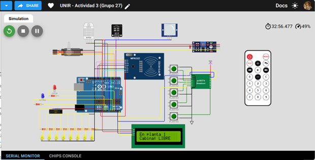
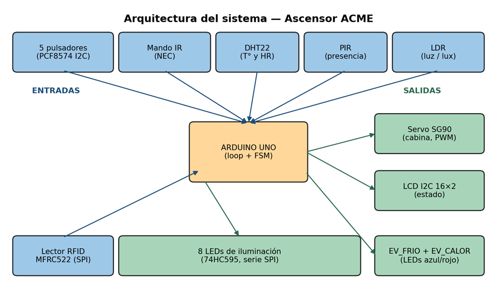
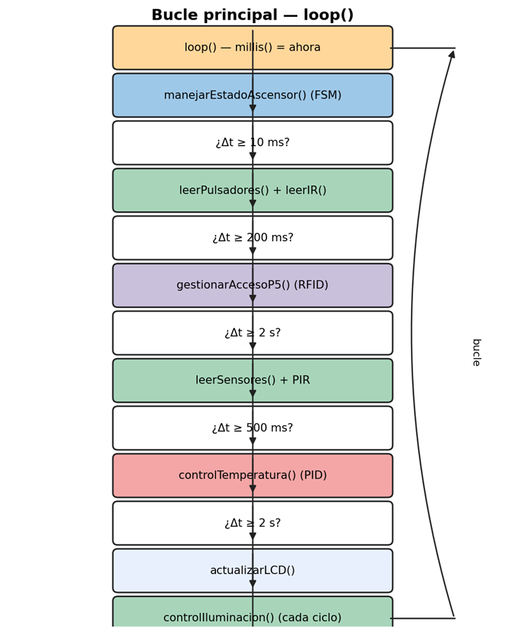
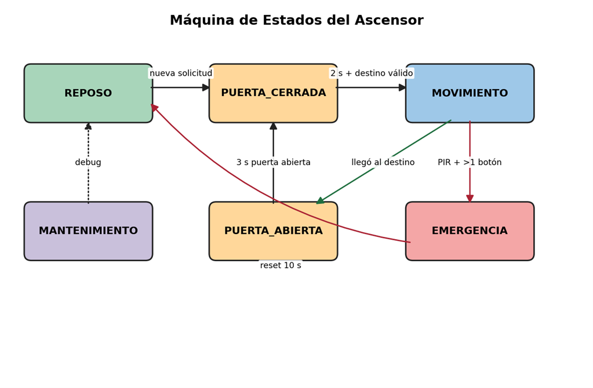
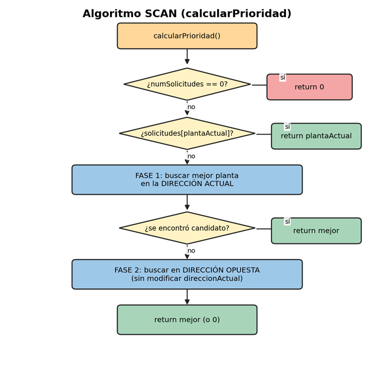
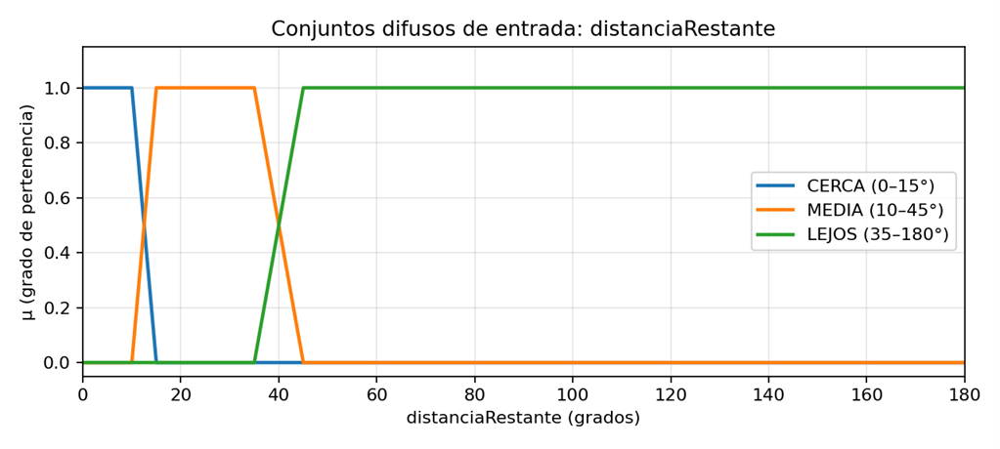
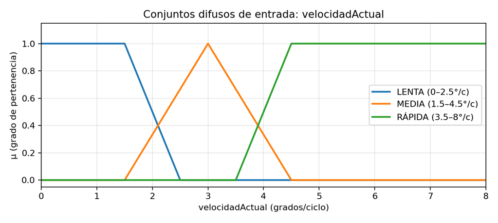
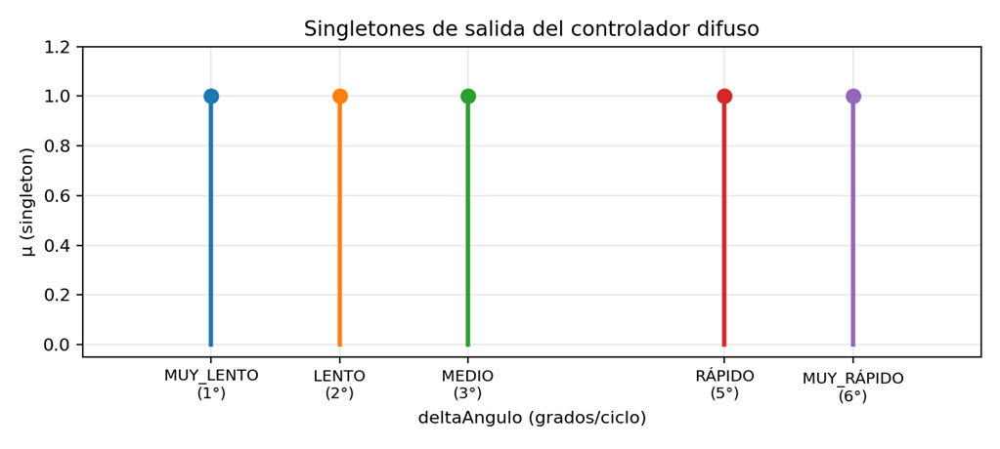
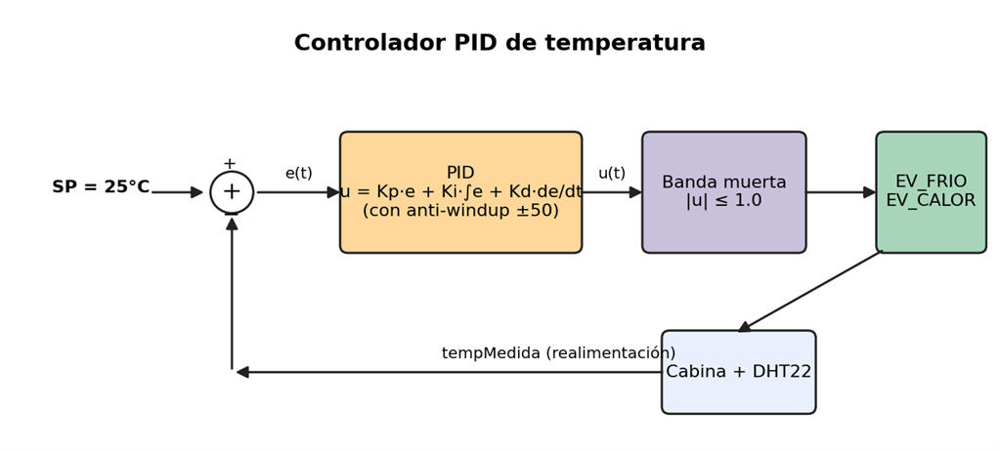

# Introducción y alcance del proyecto y alcance del proyecto

El presente documento describe el diseño y la implementación del firmware de un ascensor inteligente para un edificio de cinco plantas, desarrollado sobre la plataforma Arduino UNO y verificado mediante simulación en el entorno Wokwi. El sistema integra el conjunto de periféricos estudiados en la asignatura ---sensores, actuadores, expansores de E/S sobre bus I²C, registros de desplazamiento, bus SPI y display LCD I²C--- y articula su funcionamiento en torno a cuatro técnicas de control diferenciadas: una máquina de estados finita (FSM), un algoritmo de planificación de paradas tipo SCAN, un controlador PID para la regulación de temperatura y un controlador difuso (Mamdani) para la generación del perfil de velocidad de la cabina. El objetivo de diseño no se limita a la actuación elemental sobre el servomotor, sino a reproducir el comportamiento funcional de un ascensor real: gestión de colas de llamadas, atención de paradas intermedias, climatización, regulación de la iluminación de cabina y supervisión de condiciones de seguridad.

Adicionalmente, el sistema incorpora un subsistema de control de acceso restringido a la quinta planta basado en un lector RFID MFRC522 sobre bus SPI. Dicho subsistema emula la restricción de acceso a zonas autorizadas habitual en edificios de uso terciario, y exige la coordinación de dos bases de tiempo independientes: la del propio control de acceso, con un periodo de autorización de 15 segundos, y la de la máquina de estados del ascensor.

Esta memoria documenta exclusivamente el subsistema software. Se describen la arquitectura general del firmware, la lógica de la máquina de estados, los algoritmos de control implementados y las funciones de mayor relevancia, acompañando cada apartado con diagramas de flujo, esquemas de bloques y los fragmentos de código representativos. La estructura del documento sigue, en líneas generales, la organización del fichero fuente main.cpp, que se encuentra ampliamente comentado e incluye la trazabilidad de las correcciones introducidas entre las sucesivas versiones del firmware (v3.0 a v4.4).

### Hardware utilizado

Con carácter previo a la descripción de la lógica de control, se relacionan los periféricos que intervienen en el sistema. La Figura 1 muestra el montaje completo implementado en Wokwi y la Figura 2 representa la arquitectura por bloques del sistema, diferenciando las entradas de las salidas gestionadas por el firmware.

<p align="center">
  <br>
  <small><em>Figura 1. Captura del montaje completo en Wokwi (Arduino UNO + servo + DHT22 + PIR + IR + LDR + 74HC595 + 8 LEDs + pulsadores PCF8574 + LCD I²C + RFID MFRC522).</em></small>
</p>

<p align="center">
  <br>
  <small><em>Figura 2. Arquitectura por bloques del sistema. En azul, las entradas (sensores, lector RFID, pulsadores, mando IR); en verde, los actuadores y la interfaz de usuario (servo, LCD, LEDs y electroválvulas).</em></small>
</p>

- Arduino UNO como unidad de control central.
- Servomotor SG90 que emula el desplazamiento de la cabina (pin 3, PWM).
- Sensor DHT22 para la medida de temperatura y humedad de cabina (pin 7).
- Sensor LDR (entrada analógica A0) para la medida de illuminancia ambiental.
- Sensor PIR de presencia (pin 8), asociado a la detección en el exterior.
- Receptor IR y mando a distancia para las llamadas remotas a planta (entrada A3).
- Lector RFID MFRC522 sobre bus SPI (RST=9, SS=10, SCK=13, MOSI=11, MISO=12).
- Expansor de E/S I²C PCF8574 (dirección 0x20) para los cinco pulsadores de planta (P1--P5).
- Registro de desplazamiento 74HC595 para el gobierno de los 8 LEDs de iluminación de cabina.
- Dos LEDs indicadores que representan las electroválvulas de frío (azul, A1) y calor (rojo, A2).
- Display LCD 16×2 sobre bus I²C (dirección 0x27) como interfaz de usuario.

## Arquitectura general del firmware

Un requisito de diseño prioritario ha sido garantizar que el firmware opere de forma no bloqueante. La introducción de retardos prolongados en el bucle principal comprometería la atención de eventos asíncronos como las pulsaciones, las lecturas del lector RFID o las detecciones del sensor PIR. En consecuencia, se ha adoptado la arquitectura habitual en sistemas Arduino con múltiples tareas concurrentes: un bucle principal que invoca las distintas subtareas únicamente cuando ha transcurrido su periodo de planificación asociado, medido mediante la función millis(), junto con una máquina de estados que centraliza el comportamiento del ascensor.

El reparto temporal de las tareas se ha definido conforme al siguiente criterio: la máquina de estados se evalúa en cada iteración del bucle; la lectura de pulsadores y del mando IR se realiza cada 10 ms, con un filtro anti-rebote de 25 ms integrado en la propia rutina de lectura; el lector RFID se consulta cada 200 ms, periodo sobradamente suficiente dada la dinámica de presentación de una tarjeta; los sensores ambientales (DHT22, LDR y PIR) se muestrean cada 2 s; el controlador PID de temperatura se ejecuta cada 500 ms; el display LCD se refresca cada 2 s alternando entre dos pantallas; y el control de iluminación se evalúa en cada iteración del bucle, con objeto de minimizar la latencia de respuesta ante variaciones bruscas de iluminancia.

<p align="center">
  <br>
  <small><em>Figura 3. Diagrama de flujo del bucle principal loop(). Cada bloque verde, morado o rojo se ejecuta sólo cuando se cumple su condición temporal asociada; los bloques blancos representan los chequeos de Δt basados en millis().</em></small>
</p>

### Bucle principal

El bucle principal presenta una estructura compacta: la totalidad de la complejidad funcional se delega en la función manejarEstadoAscensor() y en las rutinas auxiliares. El listado siguiente reproduce su implementación:
```cpp
void loop() {

unsigned long ahora = millis();

// === MÁQUINA DE ESTADOS DEL ASCENSOR ===

manejarEstadoAscensor();

// 1. Entradas de usuario cada 10 ms (anti-rebote propio dentro)

if (ahora - tUltimaPulsaci >= 10) {

tUltimaPulsaci = ahora;

if (estadoAscensor != ASCENSOR_EMERGENCIA) {

leerPulsadores();

leerIR();

// 2. Control de acceso RFID cada 200 ms

if (ahora - tUltimoRFID >= 200) {

tUltimoRFID = ahora;

gestionarAccesoP5();

}

// 3. Lectura ambiental cada 2 s

if (ahora - tUltimaLectura >= 2000) {

tUltimaLectura = ahora;

leerSensores();

presencia = digitalRead(PIN_PIR);

}

// 4. Control PID de temperatura cada 500 ms

if (ahora - tUltimoProceso >= PID_INTERVALO) {

tUltimoProceso = ahora;

controlTemperatura();

}

// 5. Refresco del LCD cada 2 s (alternando páginas)

if (ahora - tUltimoLCD >= 2000) {

tUltimoLCD = ahora;

actualizarLCD();

paginaLCD = !paginaLCD;

if (cabinaMov) paginaLCD = 0;

}

// 6. Iluminación: cada ciclo, respuesta rápida ante cambios bruscos

controlIluminacion();
```
Cabe destacar un criterio de seguridad relevante: en el estado de EMERGENCIA se inhibe la lectura de pulsadores y del mando IR. De este modo, ante una manipulación anómala del panel de llamadas durante una situación excepcional, las pulsaciones no se incorporan a la cola de solicitudes. El control de iluminación, por el contrario, permanece operativo en todos los estados, al no incidir sobre la seguridad del sistema.

## Máquina de estados del ascensor

El comportamiento del ascensor se modela mediante una máquina de estados finita (FSM) compuesta por seis estados. Su diseño responde tanto a la experiencia funcional del usuario como al comportamiento físico esperado del sistema: la cabina permanece detenida, recibe una llamada, cierra la puerta, se desplaza hasta el destino, mantiene la puerta abierta durante un intervalo determinado y retorna al estado de reposo. A esta secuencia se añaden un estado de EMERGENCIA y un estado de MANTENIMIENTO; este último queda reservado para tareas de diagnóstico en la presente versión.

<p align="center">
  <br>
  <small><em>Figura 4. Máquina de estados del ascensor con sus transiciones principales. Las flechas verdes indican llegada al destino; las rojas, evento de emergencia.</em></small>
</p>

### Descripción de los estados

**REPOSO** --- la cabina permanece detenida en una planta a la espera de órdenes. Se aceptan comandos procedentes de los pulsadores (PCF8574) y del mando IR. La condición numSolicitudes > 0 provoca la transición a PUERTA_CERRADA.

**PUERTA_CERRADA** --- estado de seguridad incorporado en la versión v3.0. Establece un intervalo de 2 s previo al arranque del servomotor, que modela el tiempo de cierre completo de la puerta mecánica. En este estado se invoca calcularPrioridad() para determinar el destino y se fija de forma explícita la dirección de marcha.

**MOVIMIENTO** --- la cabina se desplaza hacia plantaDestino. El servomotor se gobierna mediante lógica difusa (capítulo 5) con objeto de obtener un perfil de velocidad suave. Durante el desplazamiento continúan aceptándose nuevas pulsaciones, y el algoritmo SCAN puede redirigir la cabina hacia una parada intermedia siempre que resulte físicamente coherente, es decir, sin inversión del sentido de marcha. El estado supervisa de forma continua el sensor PIR y el número de pulsadores activos para la detección de condiciones de emergencia.

**PUERTA_ABIERTA** --- se ha alcanzado el destino. La puerta permanece abierta durante 3 s. Transcurrido dicho intervalo se transita a PUERTA_CERRADA, estado que determinará si existe una nueva solicitud pendiente o si procede el retorno a REPOSO.

**EMERGENCIA** --- parada de seguridad. La transición a este estado requiere la concurrencia simultánea de tres condiciones: cabina en movimiento, detección de presencia en el exterior por el sensor PIR y más de un pulsador activo de forma simultánea. El diseño exige la concurrencia de las tres condiciones porque cada una de ellas, considerada aisladamente, constituye un evento operativo normal; su coincidencia durante el movimiento se interpreta como una situación anómala. Transcurridos 10 s, el sistema realiza una reinicialización automática a REPOSO.

**MANTENIMIENTO** --- estado reservado para tareas de depuración. Emite un mensaje periódico por el puerto serie. No se accede a él de forma automática; su activación debe habilitarse explícitamente desde código.

### Función de transición de estados

La gestión de las transiciones se centraliza en la función transicionEstado(), responsable tanto de las acciones de salida del estado actual como de las acciones de entrada al nuevo estado. Esta centralización evita la duplicación de lógica a lo largo del código y facilita la reinicialización de los temporizadores globales (tPuertaAbierta, tPuertaCerrada y tEmergencia) en el punto adecuado del flujo:
```cpp
void transicionEstado(EstadoAscensor nuevoEstado) {

// Acciones de salida del estado actual

switch (estadoAscensor) {

case ASCENSOR_MOVIMIENTO:

cabinaMov = false; // detener servo lógicamente

break;

case ASCENSOR_EMERGENCIA:

tEmergencia = 0;

break;

case ASCENSOR_PUERTA_ABIERTA:

tPuertaAbierta = 0;

break;

case ASCENSOR_PUERTA_CERRADA:

tPuertaCerrada = 0;

break;

default: break;

EstadoAscensor estadoPrevio = estadoAscensor;

estadoAscensor = nuevoEstado;

// Acciones de entrada al nuevo estado

switch (nuevoEstado) {

case ASCENSOR_REPOSO:

direccionActual = DIR_NINGUNA;

velocidadActual = 0.0f; // reset fuzzy

break;

case ASCENSOR_MOVIMIENTO:

cabinaMov = true;

paginaLCD = 0; // forzar página de estado en LCD

actualizarLCD();

break;

/* ... resto de estados ... */
```
En la transición a REPOSO se reinicializan tanto la dirección de marcha como la velocidad del controlador difuso. Esta última reinicialización es necesaria para evitar que el primer ciclo del desplazamiento siguiente herede la velocidad del viaje anterior; en caso contrario, el controlador difuso calcularía un incremento angular no representativo de un arranque desde reposo.

### Lógica del estado MOVIMIENTO

El estado MOVIMIENTO concentra tres responsabilidades funcionales: el recálculo del destino mediante el algoritmo SCAN, el accionamiento del servomotor a través del controlador difuso y la supervisión de las condiciones de emergencia. El siguiente fragmento corresponde a la rama del switch principal asociada a dicho estado:
```cpp
case ASCENSOR_MOVIMIENTO:

// Recalcular prioridad con validación de redirección coherente

if (numSolicitudes > 0) {

uint8_t nuevaPrioridad = calcularPrioridad();

if (nuevaPrioridad != 0 &&

nuevaPrioridad != plantaDestino &&

esRedireccionValida(nuevaPrioridad)) {

plantaDestino = nuevaPrioridad;

if (nuevaPrioridad > plantaActual) direccionActual = DIR_SUBIENDO;

else if (nuevaPrioridad < plantaActual) direccionActual = DIR_BAJANDO;

velocidadActual = 0.0f; // reset parcial para nuevo perfil fuzzy

Serial.print(F("[SCAN] Redirigiendo hacia P"));

Serial.println(plantaDestino);}

// Movimiento del servo cada SERVO_INTERVALO (65 ms)

if (ahora - tUltimoServo >= SERVO_INTERVALO) {

tUltimoServo = ahora;

moverAscensor(); }

// Llegada a destino

if (plantaActual == plantaDestino && !cabinaMov) {

eliminarSolicitud(plantaActual);

transicionEstado(ASCENSOR_PUERTA_ABIERTA); }

// Detección de emergencia (3 condiciones simultáneas)

if (presencia && contarBotonesPulsados() > 1) {

transicionEstado(ASCENSOR_EMERGENCIA); }

break;
```
Un criterio de diseño esencial es la prohibición de invertir el sentido de marcha durante el estado MOVIMIENTO. En las versiones iniciales (v4.0 y v4.1), la función calcularPrioridad() modificaba directamente la variable direccionActual como efecto colateral, lo que originaba oscilaciones de la cabina entre dos plantas próximas al destino. La corrección, introducida en la versión v4.3, traslada dicha decisión de forma exclusiva a la transición PUERTA_CERRADA → MOVIMIENTO; durante el movimiento únicamente se admiten redirecciones consistentes con la dirección actual y situadas físicamente entre la planta actual y el destino.

## Sistema de cola de solicitudes y algoritmo SCAN

El algoritmo SCAN ---también denominado elevator algorithm en la literatura, precisamente por modelar este caso de uso--- determina, en cada instante, la planta de destino cuando existen varias solicitudes pendientes. Su principio de funcionamiento consiste en mantener un sentido de marcha atendiendo todas las llamadas que se encuentren en la trayectoria y, una vez agotadas las solicitudes en ese sentido, invertir la dirección. Este criterio minimiza el número de inversiones de marcha y, con ello, el tiempo de espera medio de los usuarios y el desplazamiento total de la cabina.

### Estructura de datos de la cola

La implementación del algoritmo SCAN requiere conocer las plantas con solicitudes pendientes y, como criterios secundarios de desempate, el instante de la primera pulsación (antigüedad) y el número de pulsaciones acumuladas por planta (demanda). A tal efecto se definen tres vectores paralelos de tamaño cinco:
```cpp
#define MAX_PLANTAS 5

bool solicitudes[MAX_PLANTAS] = {false, false, false, false, false};

uint8_t contadorSolicitudes[MAX_PLANTAS] = {0, 0, 0, 0, 0};

unsigned long tiempoSolicitud[MAX_PLANTAS] = {0, 0, 0, 0, 0};

uint8_t numSolicitudes = 0;

enum DireccionAscensor { DIR_NINGUNA, DIR_SUBIENDO, DIR_BAJANDO };

DireccionAscensor direccionActual = DIR_NINGUNA;
```
La recepción de una pulsación ---procedente del PCF8574 o del mando IR--- invoca agregarSolicitud(), que marca la planta como pendiente, actualiza el contador y, en la primera pulsación, registra el instante asociado. Al alcanzar el destino se invoca eliminarSolicitud(), que libera la entrada correspondiente:
```cpp
void agregarSolicitud(uint8_t planta) {

if (planta < 1 || planta > MAX_PLANTAS) return;

uint8_t idx = planta - 1;

if (!solicitudes[idx]) {

solicitudes[idx] = true;

tiempoSolicitud[idx] = millis();

numSolicitudes++; }

// Saturar en 255 para evitar overflow del uint8_t

if (contadorSolicitudes[idx] < 255) contadorSolicitudes[idx]++; }
```
Se incorpora una protección frente a desbordamiento (corrección v4.4): el contador es de tipo uint8_t y, sin saturación, una eventual pulsación número 256 lo desbordaría a cero, invirtiendo la prioridad asignada a una planta de alta demanda. La saturación en 255 elimina por completo este modo de fallo.

### Función calcularPrioridad()

<p align="center">
  <br>
  <small><em>Figura 5. Flujo del algoritmo SCAN implementado en calcularPrioridad(). Las fases 1 y 2 corresponden a la búsqueda en la dirección actual y opuesta respectivamente; con carácter previo se evalúa la solicitud en la planta actual.</em></small>
</p>

La función calcularPrioridad() devuelve la planta de destino. En la versión v4.3 se rediseñó para eliminar comportamientos indeseados de versiones anteriores ---modificación de la dirección como efecto colateral y priorización deficiente de la planta actual--- y garantizar un flujo determinista. Su estructura, ya con las correcciones aplicadas, es la siguiente:
```cpp
uint8_t calcularPrioridad() {

if (numSolicitudes == 0) return 0;

// FASE 0: si hay solicitud en la planta actual, atenderla inmediatamente

// (gracias a la histéresis, plantaActual sólo vale eso si el servo

// está físicamente en esa planta)

if (solicitudes[plantaActual - 1]) return plantaActual;

uint8_t mejorPlanta = 0;

int8_t mejorDistancia = 127;

uint8_t mejorContador = 0;

unsigned long mejorTiempo = 0xFFFFFFFF;

// FASE 1: buscar en la dirección actual de marcha

for (uint8_t i = 0; i < MAX_PLANTAS; i++) {

if (!solicitudes[i]) continue;

uint8_t p = i + 1;

int8_t dist = 0;

bool enDir = false;

if (direccionActual == DIR_SUBIENDO || direccionActual == DIR_NINGUNA) {

if (p > plantaActual) { dist = p - plantaActual; enDir = true; } }

if (!enDir && (direccionActual == DIR_BAJANDO || direccionActual == DIR_NINGUNA)) {

if (p < plantaActual) { dist = plantaActual - p; enDir = true; } }

if (!enDir) continue;

// Criterio: distancia → contador → antigüedad

if (dist < mejorDistancia ||

(dist == mejorDistancia && contadorSolicitudes[i] > mejorContador) ||

(dist == mejorDistancia && contadorSolicitudes[i] == mejorContador && tiempoSolicitud[i] < mejorTiempo)) {

mejorPlanta = p;

mejorDistancia = dist;

mejorContador = contadorSolicitudes[i];

mejorTiempo = tiempoSolicitud[i]; }

// FASE 2: si no había nada en la dirección actual, mirar en la opuesta

// (sin tocar direccionActual: eso lo decide el llamador en PUERTA_CERRADA)

if (mejorPlanta == 0) {

/* ... idéntico bucle pero con plantas en la dirección contraria ... */

}

return mejorPlanta;
```
La jerarquía de los criterios de prioridad es determinante: en primer lugar la distancia (la proximidad de la planta determina su prioridad, conforme al criterio SCAN), en segundo lugar el contador de demanda y, finalmente, la antigüedad de la solicitud. Este último criterio previene la inanición de una planta cuya solicitud quedaría indefinidamente pospuesta ante la llegada de solicitudes más recientes con mayor prioridad por distancia.

### Validación de redirecciones

La función esRedireccionValida() actúa como salvaguarda de las redirecciones durante el estado MOVIMIENTO. Introducida en la versión v4.2, su finalidad es impedir cambios de destino carentes de coherencia física ---por ejemplo, hacia una planta ya rebasada---. En la versión v4.3 se reforzó el criterio, admitiendo durante el movimiento exclusivamente paradas intermedias coherentes con la dirección actual:
```cpp
bool esRedireccionValida(uint8_t nuevaPlanta) {

if (nuevaPlanta < 1 || nuevaPlanta > MAX_PLANTAS) return false;

if (!cabinaMov) return true; // parado: todo vale

if (nuevaPlanta == plantaDestino) return false; // ya es el destino

// Pulsar la planta donde está físicamente la cabina ⇒ parada inmediata

if (nuevaPlanta == plantaActual && solicitudes[nuevaPlanta - 1]) return true;

// Sólo paradas estrictamente intermedias en la dirección de marcha

if (direccionActual == DIR_SUBIENDO)

return (nuevaPlanta > plantaActual && nuevaPlanta < plantaDestino);

if (direccionActual == DIR_BAJANDO)

return (nuevaPlanta < plantaActual && nuevaPlanta > plantaDestino);

return false;
```
A modo de ejemplo, en un desplazamiento descendente de P5 a P1, una solicitud de P3 emitida durante el trayecto es aceptada por esRedireccionValida(), de modo que el algoritmo SCAN establece P3 como destino intermedio. Por el contrario, una solicitud de P4 emitida cuando la cabina ya ha descendido por debajo de dicha planta es rechazada como redirección y queda pendiente para la siguiente ronda de servicio. Este comportamiento es el característico de un ascensor real.

## Control difuso (fuzzy logic) del movimiento del servo

El accionamiento del servomotor se gobierna mediante un controlador difuso. El objetivo es sustituir el movimiento a velocidad constante por un perfil de velocidad trapezoidal análogo al de un ascensor real: arranque progresivo, tramo de velocidad de crucero y frenado gradual en la aproximación a la planta. Un accionamiento a velocidad constante produce un movimiento abrupto y un frenado brusco; el controlador difuso proporciona, por el contrario, una aproximación al destino notablemente más suave y realista.

### Variables y conjuntos difusos

El controlador implementado es de tipo Mamdani, con dos variables de entrada y una variable de salida:

- Entrada 1: distanciaRestante --- diferencia angular entre el ángulo actual del servo y el ángulo del destino, en el rango de 0° a 180° (P1 en 0° y P5 en 180°).
- Entrada 2: velocidadActual --- incremento angular por ciclo aplicado en el ciclo anterior, en el rango de 0 (reposo) a 8 °/ciclo (saturación).
- Salida: deltaAngulo --- incremento angular a aplicar en el ciclo actual, comprendido aproximadamente entre 0° y 6°.
<p align="center">
  <br>
  <small><em>Figura 6. Conjuntos difusos definidos para la entrada distanciaRestante. Tres conjuntos trapezoidales: CERCA, MEDIA y LEJOS.</em></small>
</p>

<p align="center">
  <br>
  <small><em>Figura 7. Conjuntos difusos definidos para la entrada velocidadActual. Dos trapezoidales (LENTA y RÁPIDA) y uno triangular (MEDIA).</em></small>
</p>

<p align="center">
  <br>
  <small><em>Figura 8. Singletones de salida (deltaAngulo). Cada regla activa desplaza la salida hacia uno de estos cinco valores discretos.</em></small>
</p>

### Base de reglas difusas

El controlador define una base de 9 reglas, correspondiente a las combinaciones de los conjuntos de entrada (3×3), resumidas en la Tabla 1:

| dist ↓ / vel → | **LENTA** | **MEDIA** | **RÁPIDA** | **comentario** |
|---|---|---|---|---|
| **CERCA** | MUY_LENTO (1°) | MUY_LENTO (1°) | LENTO (2°) | precisión / frenado |
| **MEDIA** | MEDIO (3°) | RÁPIDO (5°) | LENTO (2°) | aceleración / crucero |
| **LEJOS** | RÁPIDO (5°) | RÁPIDO (5°) | MUY_RÁPIDO (6°) | crucero / máx velocidad |

*Tabla 1. Base de reglas difusas implementada (Mamdani, AND = min).*

La interpretación física de las reglas es directa: a distancia elevada y velocidad reducida procede acelerar; a distancia elevada y velocidad ya elevada se alcanza la velocidad máxima; en la proximidad de la planta de destino procede frenar con independencia de la velocidad actual; y a distancia media se mantiene la velocidad de crucero. El conjunto reproduce el perfil de velocidad trapezoidal característico de un ascensor.

### Función de fuzzificación trapezoidal

El grado de pertenencia de un valor a un conjunto trapezoidal se calcula mediante la siguiente función. El conjunto queda definido por cuatro puntos (a, b, c, d) que delimitan el soporte y el núcleo del trapecio:
```cpp
float fuzzificarTrapezoidal(float x, float a, float b, float c, float d) {

// Se emplean los operadores < / > en los extremos (no <= / >=). Es relevante:

// los conjuntos con a==b==0 (CERCA, LENTA) deben dar μ=1 cuando x=0, y los

// conjuntos con c==d==180 (LEJOS) deben dar μ=1 cuando x=180. Con <= / >= se

// obtenía μ=0 en dichos extremos y la defuzzificación fallaba en el primer

// ciclo del trayecto P1→P5 (distancia=180°), forzando el valor de fallback.

if (x < a || x > d) return 0.0f;

if (x >= b && x <= c) return 1.0f;

if (x > a && x < b) return (x - a) / (b - a);

return (d - x) / (d - c);
```
### Inferencia y defuzzificación

El método de inferencia es Mamdani, con la conjunción AND implementada como operador mínimo. La defuzzificación se realiza por media ponderada de singletones, método de bajo coste computacional especialmente adecuado para microcontroladores, al no requerir el cálculo de áreas:
```cpp
float controlFuzzy(float distancia, float velocidad) {

// --- FASE 1: Fuzzificación de las entradas ---

float muDistCerca = fuzzificarTrapezoidal(distancia, 0,0,10,15);

float muDistMedia = fuzzificarTrapezoidal(distancia, 10,15,35,45);

float muDistLejos = fuzzificarTrapezoidal(distancia, 35,45,180,180);

float muVelLenta = fuzzificarTrapezoidal(velocidad, 0,0,1.5f,2.5f);

float muVelMedia = fuzzificarTriangular (velocidad, 1.5f,3.0f,4.5f);

float muVelRapida = fuzzificarTrapezoidal(velocidad, 3.5f,4.5f,8,8);

// --- FASE 2: Evaluación de las 9 reglas (AND = min) ---

float w[9], s[9];

w[0]=min(muDistCerca,muVelLenta); s[0]=FUZZY_OUT_MUY_LENTO;

w[1]=min(muDistCerca,muVelMedia); s[1]=FUZZY_OUT_MUY_LENTO;

w[2]=min(muDistCerca,muVelRapida); s[2]=FUZZY_OUT_LENTO;

w[3]=min(muDistMedia,muVelLenta); s[3]=FUZZY_OUT_MEDIO;

w[4]=min(muDistMedia,muVelMedia); s[4]=FUZZY_OUT_RAPIDO;

w[5]=min(muDistMedia,muVelRapida); s[5]=FUZZY_OUT_LENTO;

w[6]=min(muDistLejos,muVelLenta); s[6]=FUZZY_OUT_RAPIDO;

w[7]=min(muDistLejos,muVelMedia); s[7]=FUZZY_OUT_RAPIDO;

w[8]=min(muDistLejos,muVelRapida); s[8]=FUZZY_OUT_MUY_RAPIDO;

// --- FASE 3: Defuzzificación por media ponderada de singletones ---

float num = 0.0f, den = 0.0f;

for (uint8_t i = 0; i < 9; i++) { num += w[i] * s[i]; den += w[i]; }

float delta = (den > 0.001f) ? (num / den) : FUZZY_OUT_MUY_LENTO;

if (delta > FUZZY_VEL_MAX) delta = FUZZY_VEL_MAX;

return delta;
```
Esta función se invoca desde moverAscensor() con un periodo de SERVO_INTERVALO (65 ms en la presente configuración, equivalente a unas 15 actualizaciones por segundo). El valor devuelto se suma o resta al ángulo actual del servomotor en función del sentido de marcha, aplicando una limitación (clamping) estricta al rango [0°, 180°] para impedir que el servomotor exceda sus límites físicos.

## Control PID de la temperatura

La climatización de la cabina se implementa mediante un controlador PID discreto. La consigna (setpoint) se establece en 25 °C, y los actuadores corresponden a dos LEDs ---azul y rojo--- que representan las electroválvulas de frío y calor respectivamente. Dado que dichas electroválvulas son de naturaleza binaria (ON/OFF) y no admiten modulación, la señal de control continua u(t) generada por el PID se convierte en una actuación discreta mediante una banda muerta.

<p align="center">
  <br>
  <small><em>Figura 9. Diagrama de bloques del lazo de control PID de temperatura.</em></small>
</p>

### Parámetros y ecuación de control

Los parámetros de sintonía adoptados, ajustados de forma empírica, son los siguientes:

- Kp = 2.0 --- ganancia proporcional.
- Ki = 0.05 --- ganancia integral (con anti-windup limitado a ±50).
- Kd = 1.0 --- ganancia derivativa.
- Banda muerta = ±1.0 (en unidades de u(t)) --- evita la conmutación espuria de las válvulas.
- Zona muerta del error = ±3.0 °C --- por debajo de este umbral no se actúa.
- Periodo de ejecución = 500 ms.

La ecuación de control adopta la forma canónica: u(t) = Kp · e(t) + Ki · ∫e(τ)dτ + Kd · de(t)/dt, siendo el error e(t) = SP − tempMedida. Si u(t) > +deadband se ordena calentar; si u(t) < −deadband se ordena enfriar; en caso contrario ambas válvulas permanecen desactivadas. La zona muerta del error, de ±3 °C en torno a la consigna, se evalúa con anterioridad al propio cálculo del PID, de modo que el término integral no continúe acumulando error en las proximidades de la temperatura objetivo.

### Implementación

La función controlTemperatura() presenta una implementación directa. Los aspectos de mayor relevancia son, en primer lugar, el cálculo de dt en segundos a partir de millis(), necesario para conferir significado físico a las ganancias Ki y Kd, y, en segundo lugar, la saturación del término integral mediante constrain(), que previene el fenómeno de integral windup:
```cpp
void controlTemperatura() {

unsigned long ahora = millis();

float dt = (ahora - tUltimoPID) / 1000.0f; // pasamos a segundos

if (dt <= 0.0f) dt = 0.001f;

tUltimoPID = ahora;

float error = TEMP_SETPOINT - tempMedida;

// 1) Zona muerta del error: si estamos dentro, no controlamos

if (fabs(error) < TEMP_ZONA_M) {

accionTemp = REPOSO_TEMP;

digitalWrite(PIN_EV_FRIO, LOW);

digitalWrite(PIN_EV_CALOR, LOW);

return; } // no se actualiza el integrador

// 2) PID activo

pidIntegral += error * dt;

pidIntegral = constrain(pidIntegral, -PID_INT_MAX, PID_INT_MAX); // anti-windup

float derivada = (error - pidErrorPrev) / dt;

pidErrorPrev = error;

float salida = PID_KP * error + PID_KI * pidIntegral + PID_KD * derivada;

// 3) Decisión discreta sobre las válvulas

if (salida > PID_DEADBAND) {

accionTemp = CALENTAR;

digitalWrite(PIN_EV_FRIO, LOW); digitalWrite(PIN_EV_CALOR, HIGH);

} else if (salida < -PID_DEADBAND) {

accionTemp = ENFRIAR;

digitalWrite(PIN_EV_FRIO, HIGH); digitalWrite(PIN_EV_CALOR, LOW);

} else {

accionTemp = REPOSO_TEMP;

digitalWrite(PIN_EV_FRIO, LOW); digitalWrite(PIN_EV_CALOR, LOW); }
```
La incorporación del mecanismo anti-windup resulta determinante para la estabilidad del lazo. En ausencia de saturación del integrador, una diferencia inicial elevada entre la temperatura medida y la consigna ---por ejemplo, 5 °C frente a un setpoint de 25 °C--- provoca una acumulación excesiva del término integral mientras la planta responde con lentitud. Al alcanzarse la consigna, dicha acumulación impone un retardo considerable en la descarga del integrador, durante el cual el sistema presenta una sobreoscilación apreciable. La limitación del integrador a ±50 atenúa de forma significativa este comportamiento.

## Control de iluminación con histéresis

La iluminación interior se gobierna mediante 8 LEDs conectados a un registro de desplazamiento 74HC595, controlado por tres líneas del Arduino (DATA, CLOCK y LATCH). El objetivo de control es mantener la illuminancia próxima a un valor de confort de 500 lux: a medida que aumenta la aportación de luz natural detectada por el LDR, los LEDs se apagan progresivamente, y a la inversa en condiciones de baja iluminancia. El esquema adoptado constituye un control proporcional inverso ---a menor iluminancia natural, mayor iluminación artificial--- complementado con histéresis para evitar la conmutación oscilatoria en torno al umbral.

### Lógica de control

Los umbrales de operación definidos son los siguientes:

- Setpoint = 500 lux (nivel de confort objetivo).
- Umbral de activación = 400 lux (80 % del setpoint).
- Histéresis = ±10 lux, que delimita una zona muerta entre 390 y 410 lux.

El procedimiento divide el rango de 0 a 400 lux en 8 intervalos iguales de 50 lux, cada uno asociado a un LED. Cuanto menor es la iluminancia natural, mayor es el número de intervalos requeridos para alcanzar el umbral y, por tanto, mayor el número de LEDs activados. La expresión aplicada es LEDs = 8 − floor(luz / 50).
```cpp
void controlIluminacion() {

if (luzLux < (LUZ_UMBRAL - LUZ_HISTERESIS)) {

// < 390 lux: aumentar iluminación artificial

float intervaloLux = (float)LUZ_UMBRAL / 8.0f; // 50 lux por LED

int ledsCalculados = 8 - (int)(luzLux / intervaloLux);

ledsCalculados = constrain(ledsCalculados, 1, 8);

if (ledsCalculados != ledsEncendidos) {

ledsEncendidos = ledsCalculados;

actualizarLeds(ledsEncendidos); }

} else if (luzLux > (LUZ_UMBRAL + LUZ_HISTERESIS)) {

// > 410 lux: apagar iluminación artificial

if (ledsEncendidos > 0) {

ledsEncendidos = 0;

actualizarLeds(ledsEncendidos); } }

// Zona muerta (390-410 lux): sin cambios
```
### Escritura sobre el 74HC595

La transferencia de la máscara de bits al registro de desplazamiento se realiza mediante la función shiftOut() de Arduino, que implementa una transmisión serie por software. La función actualizarLeds() compone la máscara y escribir595() la transfiere al dispositivo:
```cpp
void actualizarLeds(uint8_t cantidad) {

uint8_t mascara = 0;

for (uint8_t i = 0; i < cantidad; i++) mascara |= (1 << i);

escribir595(mascara); }

void escribir595(uint8_t valor) {

digitalWrite(PIN_595_LATCH, LOW); // bajar latch

shiftOut(PIN_595_DATA, PIN_595_CLOCK, MSBFIRST, valor);

digitalWrite(PIN_595_LATCH, HIGH); } // subir latch → publica salidas
```
## Control de acceso restringido a la Planta 5 (RFID)

El sistema incorpora un subsistema de control de acceso a la quinta planta basado en tarjetas RFID. El lector empleado es un MFRC522, conectado al bus SPI compartido con la unidad de control. El principio de funcionamiento es el siguiente: por defecto, la llamada a P5 ---tanto desde el pulsador físico del PCF8574 como desde el mando IR--- se encuentra inhibida; al presentar una tarjeta cuyo UID figura en la lista blanca, el acceso a la quinta planta se habilita durante 15 segundos, transcurridos los cuales se restablece automáticamente la restricción. Si el usuario ha registrado la llamada a P5 dentro de dicho intervalo, el ascensor completa el trayecto aunque el periodo de autorización expire durante el desplazamiento: la autorización gobierna el derecho a encolar la solicitud, no su permanencia en la cola.

### Lista blanca de tarjetas

Cada tarjeta MIFARE Classic 1K dispone de un UID de 4 bytes. La lista blanca se almacena como un vector bidimensional de bytes:
```cpp
#define NUM_TARJETAS_REG 9

const byte TARJETAS_AUTORIZADAS[NUM_TARJETAS_REG][10] = {

{0xA1, 0xB2, 0xC3, 0xD4}, // Tarjeta maestra 1

{0x12, 0x34, 0x56, 0x78}, // Tarjeta usuario 2

{0xDE, 0xAD, 0xBE, 0xEF}, // Tarjeta mantenimiento 3

{0x01, 0x02, 0x03, 0x04}, // Blue Card

/* ... resto de tarjetas ... */
```
### Función gestionarAccesoP5()

Esta función se invoca desde el bucle principal con un periodo de 200 ms. Sus responsabilidades son la comprobación de la expiración del periodo de autorización, la detección de tarjetas, la comparación del UID con la lista blanca y, en su caso, la habilitación del acceso:
```cpp
void gestionarAccesoP5() {

unsigned long ahora = millis();

// 1. Timeout de desactivación automática

if (accesoP5Habilitado && (ahora - tActivacionP5 >= TIEMPO_ACCESO_P5)) {

accesoP5Habilitado = false;

Serial.println(F("[ACCESO P5] Tiempo expirado. Acceso restringido."));

// Si el usuario ya encoló P5, la solicitud no se elimina.

// 2. Detectar tarjeta nueva

if (!mfrc522.PICC_IsNewCardPresent()) return;

if (!mfrc522.PICC_ReadCardSerial()) return;

// 3. Validar UID contra la lista blanca

if (tarjetaAutorizada(mfrc522.uid.uidByte, mfrc522.uid.size)) {

accesoP5Habilitado = true;

tActivacionP5 = ahora;

Serial.println(F("[ACCESO P5] Tarjeta AUTORIZADA. P5 habilitada 15 s."));

} else {

Serial.println(F("[ACCESO P5] Tarjeta NO autorizada.")); }

mfrc522.PICC_HaltA();

mfrc522.PCD_StopCrypto1(); }
```
La inhibición de la llamada a P5 se aplica tanto en leerPulsadores() como en leerIR(), mediante una verificación previa a la inserción de la solicitud en la cola:
```cpp
// Dentro de leerPulsadores() / leerIR(), antes de encolar la planta 5:

if (plantaSolicitada == 5) {

if (!accesoP5Habilitado) {

Serial.println(F("[ACCESO P5] DENEGADO: se requiere tarjeta RFID autorizada"));

continue; } // no se encola la solicitud

agregarSolicitud(plantaSolicitada);
```
Se ha adoptado deliberadamente el criterio de completar el trayecto en curso aunque el periodo de autorización expire durante el mismo. Una vez iniciado el desplazamiento hacia P5, la interrupción del servicio a mitad de trayecto carecería de sentido funcional: el control de acceso tiene por finalidad regular la admisión de nuevas llamadas, no la interrupción de viajes ya iniciados.

## Funciones auxiliares relevantes

### determinarPlantaDesdeAngulo() con histéresis

Esta función determina la planta en la que se encuentra físicamente la cabina a partir del ángulo actual del servomotor. La dificultad reside en que, durante el movimiento, el ángulo recorre valores intermedios y la planta lógica podía adelantarse al destino, abriendo un intervalo en el que se cumplía plantaActual == plantaDestino sin que el servomotor hubiese alcanzado aún su posición. La versión v4.3 introduce histéresis: plantaActual se actualiza únicamente si el servomotor se halla dentro de ±10° del ángulo nominal de una planta; en las zonas de tránsito conserva el valor anterior:
```cpp
uint8_t determinarPlantaDesdeAngulo(int angulo) {

for (uint8_t i = 0; i < MAX_PLANTAS; i++) {

if (abs(angulo - ANGULO_PLANTA[i]) <= UMBRAL_LLEGADA_PLANTA) {

return i + 1; } // dentro de la zona de la planta i

return plantaActual; // zona de tránsito: conservar la anterior
```
### Filtrado anti-rebote de los pulsadores

La lectura de los cinco pulsadores se efectúa a través del expansor PCF8574 sobre bus I²C. Para mitigar los rebotes mecánicos se implementa un filtro anti-rebote temporal basado en millis(): cada variación de la lectura respecto a la anterior reinicia un temporizador, y una transición sólo se considera válida si se mantiene estable durante al menos DEBOUNCE_MS (25 ms). Asimismo, únicamente se procesan los flancos de pulsación (nivel LOW por resistencia de pull-up), descartando los de liberación para evitar inserciones duplicadas en la cola:
```C++
void leerPulsadores() {

uint8_t estadoActual = pcf8574_read();

if (estadoActual != ultimaLectura) {

ultimoCambio = millis(); } // hubo un cambio: resetear timer

ultimaLectura = estadoActual;

if ((millis() - ultimoCambio) > DEBOUNCE_MS) {

uint8_t cambios = (estadoActual ^ estadoAnterior) & BOTONES_MASK;

if (cambios != 0) {

for (uint8_t i = 0; i < 5; i++) {

if (cambios & (1 << i)) {

bool presionado = !(estadoActual & (1 << i)); // LOW = pulsado

if (presionado) {

uint8_t plantaSolicitada = i + 1;

// Validación RFID si es P5...

agregarSolicitud(plantaSolicitada); }
.....
estadoAnterior = estadoActual;
```
### Lectura del LDR y conversión a lux

El sensor LDR proporciona una lectura analógica comprendida entre 0 y 1023. La conversión a lux se realiza en dos etapas: en primer lugar se obtiene la resistencia del LDR a partir del divisor de tensión del módulo (resistencia serie de 2 kΩ); a continuación se aplica la ecuación característica logarítmica del sensor (R_L10 = 50 kΩ a 10 lux, γ = 0.7):
```cpp
float leerLux() {

int analogValue = analogRead(PIN_LDR);

if (analogValue < 0) return 0;

float voltage = analogValue / 1024.0 * 5.0;

float resistance = 2000 * voltage / (1 - voltage / 5.0);

// Modelo de potencia (power law) del LDR

float lux = pow(RL10 * 1e3 * pow(10, GAMMA) / resistance, (1 / GAMMA));

return lux; }
```
### Refresco del display LCD

El display LCD I²C 16×2 presenta dos pantallas alternadas con un periodo de 2 segundos. La pantalla 0 indica la planta actual y el estado de ocupación de la cabina (señal del sensor PIR); la pantalla 1 muestra la temperatura, la humedad, la iluminancia y la acción de climatización en curso. Durante el desplazamiento se fuerza la pantalla 0, de modo que el usuario disponga en todo momento de la información de estado de la cabina:
```cpp
void actualizarLCD() {

lcd.clear();

if (paginaLCD == 0) {

lcd.setCursor(0, 0);

if (cabinaMov) {

lcd.print(F("Moviendo "));

lcd.print(plantaActual); lcd.print(F("->"));

lcd.print(plantaDestino);

} else {

lcd.print(F("En planta ")); lcd.print(plantaActual); }

lcd.setCursor(0, 1);

lcd.print(presencia ? F("Cabina: OCUPADA") : F("Cabina: LIBRE"));

} else {

lcd.setCursor(0, 0);

lcd.print(F("T:")); lcd.print(tempMedida, 1);

lcd.write((char)223); // símbolo °

lcd.print(F("C H:")); lcd.print((int)humMedida); lcd.print(F("%"));

lcd.setCursor(0, 1);

lcd.print(F("L:")); lcd.print((int)luzLux); lcd.print(F("lux "));

if (accionTemp == ENFRIAR) lcd.print(F("ENFRIAR"));

if (accionTemp == CALENTAR) lcd.print(F("CALDEAR"));
```
## Evolución del firmware y correcciones aplicadas

Dada la complejidad del sistema, el firmware ha experimentado una evolución a lo largo de varias versiones. Se documenta a continuación dicha evolución, por cuanto las correcciones introducidas constituyen la base de la robustez del sistema y reflejan los principales problemas de diseño abordados.

### v3.0 --- estructura inicial con FSM y cola de solicitudes

Versión base que establece la máquina de estados, el sistema de cola múltiple y el algoritmo SCAN. Incorpora el estado PUERTA_CERRADA como medida de seguridad previa al inicio del movimiento.

### v4.0 --- incorporación del control difuso

Sustitución del avance a velocidad fija del servomotor (1 °/ciclo) por el controlador difuso completo de 9 reglas. La modificación introduce un perfil de velocidad trapezoidal, con fases diferenciadas de aceleración y frenado.

### v4.2 --- robustez del SCAN durante el movimiento

Esta versión aborda tres defectos relevantes: (1) un bucle no convergente al producirse una redirección durante el movimiento, originado por la oscilación de plantaDestino en cada ciclo frente a la inercia del servomotor; (2) la tentativa del servomotor de exceder el rango físico [0°, 180°] ante cambios bruscos del destino; y (3) la evaluación de la redirección respecto de la planta de origen en lugar de la planta actual física. Las soluciones aplicadas comprenden la limitación estricta del ángulo, el recálculo del sentido de marcha por comparación de anguloServo con el destino en cada ciclo, y la incorporación de la función esRedireccionValida().

### v4.3 --- histéresis de planta y SCAN sin efectos colaterales

El defecto principal corregido en esta versión consistía en una oscilación de la cabina entre dos plantas, manifestada al solicitar una planta intermedia (P3) durante un trayecto descendente de P5 a P1. Su causa raíz era la concurrencia de tres factores encadenados: la zona muerta de ±22° en determinarPlantaDesdeAngulo(), que provocaba la actualización prematura de plantaActual; la omisión de plantaActual como candidata en calcularPrioridad() salvo como último recurso; y la modificación de direccionActual como efecto colateral de dicha función durante el movimiento. La solución comprendió cinco cambios coordinados: histéresis de ±10° en la actualización de plantaActual, evaluación prioritaria explícita de la planta actual en calcularPrioridad(), supresión de los efectos colaterales sobre direccionActual, regla SCAN estricta de paradas intermedias, y traslado de la decisión de inversión de marcha a la transición PUERTA_CERRADA → MOVIMIENTO.

### v4.4 --- control de acceso RFID a la Planta 5

Integración del lector MFRC522 sobre bus SPI, la lista blanca de UIDs, el periodo de autorización de 15 s y la validación de acceso tanto en la ruta del pulsador físico como en la del mando IR. Esta versión incorpora asimismo dos correcciones menores: la saturación a 255 del contador de solicitudes, frente al desbordamiento del tipo uint8_t, y la actualización de direccionActual tras una redirección durante el movimiento.

### Conclusiones del proceso de depuración

Más allá de cada corrección concreta, el proceso de depuración consolida un conjunto de buenas prácticas en el ámbito del control en tiempo real: (1) la conveniencia de evitar que las máquinas de estado introduzcan efectos colaterales sobre variables compartidas; (2) la dependencia de los controladores ---difuso o PID--- respecto de la robustez de sus señales de entrada, garantizada mediante histéresis, filtrado anti-rebote y saturación de contadores; (3) la necesidad de limitar (clamping) las señales de salida a sus rangos físicos con independencia de las garantías teóricas de la lógica; (4) la mayor incidencia de los defectos en la interacción entre módulos que en su comportamiento aislado; y (5) la utilidad de una traza exhaustiva por el puerto serie como herramienta esencial para la identificación de defectos.

## Conclusiones

El proyecto ha permitido integrar, sobre una única plataforma Arduino UNO, la práctica totalidad de los buses y protocolos contemplados en la asignatura: I²C (LCD y PCF8574), SPI (lector RFID MFRC522), una variante de transmisión serie por software (74HC595), modulación PWM (servomotor SG90), adquisición analógica (LDR) y entradas digitales con protocolos específicos (DHT22, PIR e IR según codificación NEC). La coexistencia de estos subsistemas exige una planificación rigurosa de los recursos ---asignación de pines, interrupciones y temporizadores--- y, de forma destacada, un reparto adecuado del tiempo de CPU que garantice la operación concurrente sin interferencias.

En el plano del software, el principal valor del desarrollo reside en la combinación de cuatro técnicas de control diferenciadas: una máquina de estados finita para la lógica discreta del ascensor, un algoritmo SCAN para la gestión de la cola de llamadas, un controlador PID para la regulación de temperatura ---con anti-windup, banda muerta y zona muerta del error--- y un controlador difuso de Mamdani para el perfil de velocidad del servomotor. Cada técnica resuelve una clase de problema específica, y su selección y aplicación adecuadas han requerido justificar la idoneidad de cada una en su contexto.

El desarrollo evidencia, asimismo, que el comportamiento físico de la planta no puede obviarse en el diseño del control. Las primeras versiones del algoritmo SCAN resultaban correctas en el plano teórico, pero su combinación con la dinámica real del servomotor ---inercia, latencia y discretización angular--- originaba oscilaciones que únicamente se resolvieron mediante la introducción de histéresis y la separación explícita entre el estado lógico y el estado físico del sistema. Esta observación es coherente con los principios de la teoría de control: la dinámica de la planta condiciona el diseño, y los algoritmos deben adaptarse a ella.

Como líneas de trabajo futuro se identifican varias: la implementación de un control de velocidad real del servomotor en lugar de su emulación mediante incrementos angulares; la parametrización del controlador difuso mediante un fichero de configuración, que permita modificar los conjuntos sin necesidad de recompilación; la incorporación de un módulo de registro persistente (tarjeta SD o EEPROM) para el almacenamiento de trayectos, alarmas y eventos de acceso RFID; y, en el ámbito de la conectividad, la integración de un canal de telemetría (MQTT o BLE) para la monitorización remota del sistema. Estas ampliaciones exceden, no obstante, el alcance de la presente actividad.

En síntesis, el proyecto ha permitido integrar un conjunto amplio de conceptos en un sistema funcional único, abordar problemas de depuración de complejidad no trivial y estructurar un firmware Arduino más allá del patrón elemental setup()/loop(). El resultado obtenido satisface los objetivos funcionales planteados: la cabina presenta un arranque y un frenado progresivos, atiende las paradas intermedias conforme al criterio SCAN y se detiene de forma segura ante la detección de condiciones anómalas durante el movimiento. Por la cobertura de técnicas y subsistemas alcanzada, esta memoria se concibe como base documental para la futura documentación oficial del proyecto.
