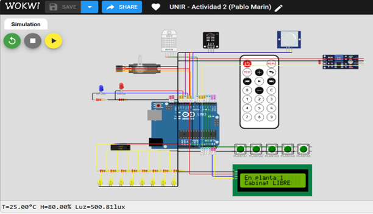

Proyecto de perfeccionamiento del sistema de control del ascensor inteligente ACME, de la Actividad 2 a la Actividad 3. Aquí se documentan las mejoras que se han implementado.

**Simulación ACTIVIDAD 2:**

Simulación en Wokwi: https://wokwi.com/projects/461843709827701761



**Simulación ACTIVIDAD 3:**

Simulación en Wokwi: https://wokwi.com/projects/464679537824441345


## 1. Resumen

En esta memoria documentamos la evolución del sistema de control del ascensor inteligente ACME S.A. desde la versión 2.0, que fue el punto de partida en la asignatura, hasta la versión 4.4, que es la que entregamos como resultado final. Hemos partido de un código que ya funcionaba bastante bien para una cabina con cinco plantas (servo, PID de temperatura, control de iluminación con LDR y mando IR), y hemos ido añadiendo módulos de forma incremental siguiendo un enfoque por hitos: cola de solicitudes con algoritmo SCAN, controlador difuso para el perfil de velocidad del servo, un estado intermedio de cierre de puerta, expansión de E/S mediante un PCF8574 y, por último, un sistema de control de acceso restringido a la planta 5 mediante RFID MFRC522.

Cada uno de estos cambios ha implicado modificaciones tanto del hardware (nuevos componentes, reasignación de pines del Arduino Uno) como del firmware (nuevas máquinas de estados, nuevos algoritmos de prioridad y nuevas funciones de validación). El sistema final ha sido verificado en simulación con Wokwi y funciona de forma estable bajo distintos escenarios de uso. En las páginas que siguen explicamos qué hemos añadido y por qué, qué bugs nos hemos encontrado en el camino y cómo los hemos resuelto.

## 2. Introducción y objetivos

El proyecto consiste en programar el firmware de un ascensor de 5 plantas usando un Arduino Uno como controlador principal. La versión 2.0 ya implementaba la funcionalidad básica: el ascensor recibía órdenes desde 5 pulsadores físicos o desde un mando a distancia IR y se desplazaba a la planta solicitada mediante un servo SG90. Incluía además un control de temperatura PID, un control de iluminación basado en LDR con histéresis, y una máquina de estados sencilla con cinco estados (REPOSO, MOVIMIENTO, PUERTA_ABIERTA, EMERGENCIA, MANTENIMIENTO).

El enunciado de la Actividad 3 nos pedía dar un salto cualitativo: ampliar las funcionalidades del ascensor para que se acerque al comportamiento de un equipo real. Nos marcamos los siguientes objetivos:

- Permitir múltiples solicitudes simultáneas (cola de plantas), no solo una orden cada vez.
- Atender las solicitudes en un orden lógico y eficiente, como hacen los ascensores reales, mediante un algoritmo SCAN.
- Sustituir la velocidad fija del servo (1°/ciclo) por un perfil suave con arranque progresivo, crucero y frenado, usando un controlador difuso.
- Liberar pines del Arduino mediante un expansor I2C (PCF8574) para los pulsadores.
- Implementar un control de acceso restringido a la planta 5 mediante lector RFID, validando una lista blanca de tarjetas.

El resultado es la versión 4.4, que conserva la misma filosofía no bloqueante del bucle principal (sin delays) y que añade aproximadamente 1.300 líneas de código sobre la versión 2.0, distribuidas en varios módulos lógicamente separados.

## 3. Descripción del hardware

### 3.1. Componentes utilizados

El listado de componentes del sistema v4.4 es el siguiente:

- **Arduino Uno** como microcontrolador principal (ATmega328P, 16 MHz, 2 KB SRAM).
- **Servomotor SG90** conectado al pin digital 3 (PWM), que mueve la cabina entre 0° (P1) y 180° (P5).
- **Sensor DHT22** en el pin 7 para medir temperatura y humedad ambiente.
- **LDR (fotorresistencia)** en A0, calibrada para devolver iluminancia en lux.
- **Sensor PIR** en el pin 8 para detectar presencia en el exterior de la cabina.
- **Receptor IR** en el pin A3 y mando a distancia con codificación NEC.
- **Registro de desplazamiento 74HC595** (DATA=6, CLOCK=5, LATCH=4) que controla 8 LEDs amarillos para la iluminación artificial.
- **LCD I²C 16×2** en el bus I²C principal (SDA=A4, SCL=A5) para mostrar el estado.
- **Expansor I²C PCF8574** en la dirección 0x20, con los 5 pulsadores de planta conectados a P0--P4. *[NUEVO en v4.4]*
- **Lector RFID MFRC522** conectado por bus SPI (RST=9, SS=10, SCK=13, MOSI=11, MISO=12, 3.3 V). *[NUEVO en v4.4]*
- **Dos LEDs indicadores** (azul en A1 para EV_FRIO, rojo en A2 para EV_CALOR) que simulan las electroválvulas de climatización.

### 3.2. Cambios respecto a la versión 2.0

La versión 2.0 conectaba los cinco pulsadores directamente a pines digitales y analógicos del Arduino (2, 3, A1, A2 y A3), lo cual consumía recursos preciosos del microcontrolador. Cuando empezamos a añadir el lector RFID nos dimos cuenta de que íbamos a quedarnos sin pines disponibles, sobre todo porque el MFRC522 necesita el bus SPI completo (pines 10--13) y reserva además un pin de Reset. La solución que adoptamos fue trasladar los pulsadores a un expansor PCF8574 conectado por I²C, que nos libera 5 pines de un golpe y solo consume las dos líneas SDA/SCL que ya estaban en uso por el LCD.

Como consecuencia de este movimiento, varios periféricos cambiaron de pin: el servo pasó del pin 9 al 3, el receptor IR pasó del pin 11 al A3, y los LEDs de las electroválvulas se reubicaron en A1 y A2. El pin 9 quedó liberado para el RST del MFRC522. La siguiente tabla resume los cambios principales:

| Periférico | Pin v2.0 | Pin v4.4 |
|---|---|---|
| Servo SG90 | 9 | 3 (PWM) |
| Receptor IR | 11 | A3 |
| EV_FRIO (LED azul) | 10 | A1 |
| EV_CALOR (LED rojo) | 12 | A2 |
| Pulsadores P1--P5 | 2, 3, A1, A2, A3 | PCF8574 (P0--P4) |
| RFID RST | --- | 9 |
| RFID SS / SDA | --- | 10 |
| RFID SPI (SCK/MOSI/MISO) | --- | 13 / 11 / 12 |

## 4. Arquitectura del software

El firmware sigue un patrón de máquina de estados finitos (FSM) ejecutada de forma no bloqueante dentro del `loop()` principal. Toda la lógica del ascensor pasa por la función `manejarEstadoAscensor()`, mientras que las tareas paralelas (lectura de sensores, control PID de temperatura, control de iluminación, refresco del LCD, lectura RFID) se programan con temporizadores basados en `millis()` para no bloquear el procesador. Esto nos permite, por ejemplo, que el ascensor pueda detectar una nueva pulsación mientras está en pleno movimiento, recalcular la prioridad SCAN y desviarse a una parada intermedia sin perder ningún ciclo.

Los principales módulos del firmware en v4.4 son:

- Máquina de estados del ascensor (6 estados).
- Sistema de cola de solicitudes y algoritmo de prioridad SCAN.
- Controlador difuso Mamdani para el perfil de velocidad del servo.
- Controlador PID discreto de temperatura.
- Control de iluminación proporcional inverso con histéresis.
- Módulo RFID de control de acceso a la planta 5.
- Driver I²C del PCF8574 y rutina anti-rebote para los pulsadores.

## 5. Máquina de estados ampliada

En la v2.0 el ascensor pasaba directamente de REPOSO a MOVIMIENTO en cuanto recibía una orden. En la práctica esto no es realista, porque un ascensor real necesita un par de segundos para cerrar la puerta antes de arrancar. Por eso en la v3.0 introdujimos un sexto estado intermedio llamado PUERTA_CERRADA, en el que la cabina espera 2 segundos antes de comenzar a moverse. El diagrama de transiciones resultante es el siguiente:

```
[REPOSO] ──(hay solicitud)──► [PUERTA_CERRADA] ──(2 s)──► [MOVIMIENTO]
    ▲                              │                              │
    │                              │                              │
    │         (llegó al destino)   │                              │
    │◄──[PUERTA_ABIERTA]◄──────────┘                              │
    │         (3 s)                                               │
    │                                                             │
    └──[EMERGENCIA]◄──(presencia PIR + >1 botón pulsado) ─────────┘
              (reset auto 10 s)
```

El estado EMERGENCIA se mantiene con la misma lógica de la v2.0: se activa solo si concurren las tres condiciones simultáneamente (cabina en movimiento, PIR detectando presencia exterior y más de un pulsador pulsado a la vez), porque esa combinación se interpreta como una manipulación anómala del panel de llamada. Tras 10 segundos se hace reset automático a REPOSO.

## 6. Sistema de cola y algoritmo SCAN

### 6.1. Estructura de la cola

En la v2.0 cuando el usuario pulsaba un botón, la variable `plantaDestino` se sobrescribía sin contemplaciones, perdiéndose cualquier solicitud anterior. Esto es claramente insuficiente: en un ascensor real el usuario puede llamarlo desde varias plantas a la vez. La solución fue añadir una pequeña estructura de cola con tres arrays paralelos de tamaño 5:

```cpp
bool solicitudes[MAX_PLANTAS];              // true = planta pendiente
uint8_t contadorSolicitudes[MAX_PLANTAS]; // nº de pulsaciones acumuladas
unsigned long tiempoSolicitud[MAX_PLANTAS]; // timestamp 1ª pulsación
```

Cada vez que se detecta una pulsación válida (sea por botón físico o por mando IR) se llama a `agregarSolicitud(planta)`, que marca el flag correspondiente, registra el timestamp si es la primera pulsación e incrementa el contador. Cuando el ascensor atiende físicamente una planta, `eliminarSolicitud(planta)` la borra de la cola.

### 6.2. Algoritmo de prioridad SCAN

El algoritmo SCAN, también conocido como Elevator Algorithm, es el método clásico utilizado por los ascensores reales para decidir el orden de atención cuando hay varias plantas pendientes. La idea básica es muy intuitiva: mientras el ascensor sube, atiende todas las solicitudes superiores que se encuentre en el camino, en orden ascendente; cuando ya no quedan solicitudes en esa dirección, invierte la marcha y baja atendiendo en orden descendente. De este modo se evita que el ascensor cambie continuamente de dirección, lo cual sería poco eficiente y muy molesto para los usuarios.

Nuestra implementación tiene tres criterios de desempate, aplicados en cascada:

1. **Distancia**: gana la planta más cercana en la dirección actual de marcha.
2. **Demanda acumulada**: si hay empate en distancia, gana la planta que ha sido pulsada más veces (`contadorSolicitudes` mayor).
3. **Antigüedad**: si persiste el empate, gana la solicitud más antigua (`tiempoSolicitud` menor).

La función `calcularPrioridad()` implementa este algoritmo en tres fases. La FASE 0 (añadida en v4.3) comprueba primero si la planta actual está en cola, para atenderla inmediatamente (distancia=0). La FASE 1 busca en la dirección actual; si no encuentra nada, la FASE 2 busca en la opuesta. La función devuelve simplemente el número de planta prioritario, sin efectos secundarios sobre la dirección de marcha (corrección importante de v4.3 que veremos más abajo).

### 6.3. Validación de redirecciones durante el movimiento

Uno de los puntos delicados del SCAN es decidir qué hacer cuando llega una nueva pulsación mientras el ascensor ya está en marcha. Las primeras versiones tenían un comportamiento incorrecto: si el ascensor estaba bajando de P5 a P1 y alguien pulsaba P5, intentaba dar media vuelta y volver, lo cual no tiene ningún sentido físico. En v4.3 añadimos la función `esRedireccionValida()`, que aplica una regla SCAN estricta:

- Solo se acepta una redirección si la nueva planta está estrictamente entre la planta actual y la planta destino, en la misma dirección de marcha.
- Las solicitudes en dirección opuesta o ya superadas quedan en cola y se atienden en la siguiente ronda, cuando el ascensor vuelva a pasar por allí.
- Solo se puede invertir la marcha al pasar por el estado PUERTA_CERRADA, nunca en pleno movimiento.

## 7. Control difuso del servomotor

En la v2.0 el servo avanzaba a velocidad constante de 1°/ciclo (cada 65 ms), lo que producía un movimiento mecánico y poco realista. Para acercarnos al comportamiento de un ascensor real, en la v4.0 sustituimos esta lógica por un controlador difuso (fuzzy logic) de tipo Mamdani con dos entradas y una salida. El objetivo era conseguir un perfil de velocidad trapezoidal: arranque progresivo desde reposo, velocidad de crucero estable en el centro del trayecto, y frenado suave al acercarse al destino, todo con buena precisión en los últimos grados.

### 7.1. Entradas y conjuntos difusos

El controlador toma dos magnitudes como entrada:

- `distanciaRestante`: ángulo restante hasta el destino, en grados (0--180°).
- `velocidadActual`: velocidad del ciclo anterior, en grados por ciclo (0--8°/ciclo).

Cada entrada se fuzzifica sobre tres conjuntos difusos. Para la distancia: **CERCA** (0--15°), **MEDIA** (10--45°) y **LEJOS** (35--180°), todos definidos como funciones trapezoidales. Para la velocidad: **LENTA** (0--2.5°), **MEDIA** (1.5--4.5°, triangular) y **RÁPIDA** (3.5--8°). La salida es el incremento de ángulo `deltaAngulo` para este ciclo y se modela mediante cinco singletones:

- `MUY_LENTO` = 1°
- `LENTO` = 2°
- `MEDIO` = 3°
- `RAPIDO` = 5°
- `MUY_RAPIDO` = 6°

### 7.2. Base de reglas

La base de reglas combina las tres etiquetas de distancia con las tres de velocidad, generando un total de 9 reglas. La filosofía es bastante intuitiva: cuando estamos lejos y vamos rápido, mantener velocidad alta (crucero); cuando nos acercamos al destino, frenar progresivamente; cuando arrancamos desde reposo y queda mucho camino, acelerar. La tabla siguiente resume las 9 reglas:

| Distancia | Velocidad | Salida (deltaAngulo) |
|---|---|---|
| CERCA | LENTA | MUY_LENTO (precisión) |
| CERCA | MEDIA | MUY_LENTO (frenado final) |
| CERCA | RÁPIDA | LENTO (frenado suave) |
| MEDIA | LENTA | MEDIO (aceleración) |
| MEDIA | MEDIA | RÁPIDO (crucero) |
| MEDIA | RÁPIDA | LENTO (frenado anticipado) |
| LEJOS | LENTA | RÁPIDO (arranque) |
| LEJOS | MEDIA | RÁPIDO (mantener crucero) |
| LEJOS | RÁPIDA | MUY_RÁPIDO (máx. velocidad) |

### 7.3. Inferencia y defuzzificación

Aplicamos el método de inferencia Mamdani con operador AND mínimo (min) entre los grados de pertenencia de cada antecedente, obteniendo el peso de activación de cada regla. La defuzzificación se hace por media ponderada de los singletones de salida (esto es matemáticamente equivalente al centro de gravedad cuando las salidas son singletones), siguiendo la fórmula clásica:

```
        Σ (w_i · s_i)
delta = ─────────────
        Σ w_i
```

Donde `w_i` es el peso de activación de la regla i y `s_i` es su singleton de salida. Si todos los pesos resultan ser cero (caso raro pero posible), se aplica un fallback de seguridad que devuelve MUY_LENTO. Adicionalmente, se aplica un límite superior de `FUZZY_VEL_MAX = 6°/ciclo` como protección frente a valores extraños, y a partir de 2° de distancia restante se fuerza explícitamente MUY_LENTO para garantizar la precisión de parada.

## 8. Control de acceso RFID a la planta 5

La novedad principal de la versión 4.4 es el sistema de control de acceso restringido a la planta 5, pensada como zona privada (por ejemplo, oficinas de dirección o áreas de mantenimiento). Para implementarlo añadimos un lector RFID MFRC522 conectado por bus SPI, junto con una lista blanca de UIDs autorizados directamente embebida en el código.

### 8.1. Conexionado y librería

El MFRC522 se conecta mediante 7 cables: SPI completo (SCK, MOSI, MISO en los pines 13, 11 y 12 respectivamente), SS/SDA en el pin 10, RST en el pin 9, y alimentación 3.3 V/GND. Empleamos la librería pública MFRC522 (incluida en el gestor de bibliotecas del IDE), inicializándola en el `setup()` con:

```cpp
SPI.begin();
mfrc522.PCD_Init();
byte version = mfrc522.PCD_ReadRegister(mfrc522.VersionReg);
```

Como medida defensiva, en el `setup()` leemos el registro `VersionReg` del módulo: si devuelve `0x00` o `0xFF` significa que el lector no responde y mostramos un aviso por el monitor serie, sin abortar el arranque del resto del sistema.

### 8.2. Lista blanca y validación de UIDs

Las tarjetas autorizadas se almacenan en un array constante con 9 entradas predefinidas (tarjeta maestra, mantenimiento y varios usuarios). Cada UID tiene 4 bytes, que es el tamaño estándar de las tarjetas MIFARE Classic 1K. Para validar un UID leído, la función `tarjetaAutorizada()` recorre la lista y compara byte a byte:

```cpp
bool tarjetaAutorizada(byte *uidBuffer, byte bufferSize) {
  if (bufferSize != 4) return false;
  for (uint8_t i = 0; i < NUM_TARJETAS_REG; i++) {
    bool coincide = true;
    for (uint8_t j = 0; j < 4; j++) {
      if (uidBuffer[j] != TARJETAS_AUTORIZADAS[i][j]) { 
        coincide = false; break; 
      }
    }
    if (coincide) return true; }
  return false;
}
```

### 8.3. Lógica de desbloqueo temporal

Cuando un usuario acerca una tarjeta válida, el sistema activa el flag `accesoP5Habilitado` durante 15 segundos (definido en la constante `TIEMPO_ACCESO_P5`). Durante esa ventana, las pulsaciones de P5 (tanto por botón físico como por mando IR) se aceptan con normalidad. Pasados los 15 segundos el acceso se vuelve a bloquear automáticamente.

Un detalle importante de diseño: si el usuario ya estaba dentro del ascensor y había encolado P5 antes de que expirara el timeout, el viaje se completa normalmente. La autorización RFID controla el derecho a encolar nuevas solicitudes de P5, no la capacidad del ascensor de terminar un trayecto ya iniciado. Esta decisión está documentada como comentario en el propio código para que el comportamiento sea inequívoco.

La gestión completa se realiza cada 200 ms en la función `gestionarAccesoP5()`, llamada desde el `loop()` principal:

- Comprueba si ha expirado el timeout de 15 s y, en su caso, desactiva el flag.
- Detecta la presencia de una tarjeta nueva con `PICC_IsNewCardPresent()`.
- Lee el UID con `PICC_ReadCardSerial()`.
- Lo valida contra la lista blanca y, si es correcto, activa el acceso y registra el timestamp.
- Si no es válida, lo notifica por Serial sin alterar nada más.

## 9. Expansor PCF8574 y lectura de pulsadores

El PCF8574 es un expansor de 8 bits de E/S por I²C que ya conocíamos de prácticas anteriores. Configurado con A0=A1=A2=GND queda en la dirección 0x20. Los cinco pulsadores se conectan a P0--P4 con pull-up interno activado por software escribiendo 0xFF al puerto en el setup, de modo que los pulsadores trabajan en lógica activo-bajo (LOW cuando se pulsan). La lectura del puerto se hace con la siguiente rutina:

```cpp
uint8_t pcf8574_read() {
  uint8_t valor = 0xFF;
  Wire.requestFrom(PCF8574_ADDR, (uint8_t)1);
  if (Wire.available()) valor = Wire.read();
  return valor;
}
```

Sobre la lectura cruda aplicamos un anti-rebote por software con ventana de 25 ms y detección de flanco descendente (solo nos interesa el evento de pulsación, no el de soltado). Cuando se detecta un flanco válido, se invoca `agregarSolicitud()` para encolar la planta correspondiente. Si la planta solicitada es la 5, antes de encolarla se consulta el flag `accesoP5Habilitado` y, si está bloqueada, se rechaza emitiendo un mensaje por el monitor serie.

## 10. Bugs encontrados y resueltos

A lo largo del desarrollo nos hemos encontrado con varios problemas que vale la pena documentar, porque ilustran bien las dificultades habituales al combinar control físico con lógica discreta. La mayoría de ellos se resolvieron en las versiones 4.2 y 4.3, y otros tres más finos los detectamos ya en la v4.4 cuando hicimos pruebas con cargas de trabajo más complejas.

### Bug 1 — Oscilación entre destino y planta intermedia (v4.3)

**Escenario**: el ascensor está bajando de P5 a P1 y se pulsa P3 a mitad de trayecto. La cabina se quedaba oscilando indefinidamente entre P3 y P1 sin poder detenerse. La causa era una combinación de tres problemas: la función `determinarPlantaDesdeAngulo()` usaba una zona muerta de ±22° que hacía que `plantaActual` saltara al valor del destino antes de que el servo llegara físicamente; `calcularPrioridad()` modificaba `direccionActual` como efecto secundario; y la fase 1 del SCAN no contemplaba `plantaActual` como candidata. La solución pasó por introducir histéresis en la detección de planta (±10° respecto al ángulo nominal) y reorganizar `calcularPrioridad()` para que la planta actual fuera la primera candidata si tenía solicitud activa.

### Bug 2 — Clamping del servo (v4.2)

Sin protecciones, en algunos escenarios con redirecciones rápidas el ángulo del servo podía calcularse fuera del rango [0, 180], lo que provocaba que el SG90 hiciera un giro completo o se quedara en su tope mecánico. Añadimos un clamping estricto al final de cada iteración de `moverAscensor()` para garantizar que el valor escrito al servo siempre estuviera dentro del rango válido.

### Bug 3 — Overflow del contador de solicitudes (v4.4)

El array `contadorSolicitudes[]` estaba declarado como `uint8_t`, con un valor máximo de 255. En un caso extremo de pulsaciones repetidas a la misma planta el contador desbordaba a 0, invirtiendo el orden de prioridad: una planta muy demandada pasaba a tener menos prioridad que una recién pulsada. La solución fue saturar el contador en 255 en lugar de permitir el overflow:

```cpp
if (contadorSolicitudes[idx] < 255) contadorSolicitudes[idx]++;
```

### Bug 4 — Fuzzificación en los extremos del soporte (v4.4)

La función `fuzzificarTrapezoidal()` usaba comparaciones `<= a` y `>= d` para detectar valores fuera del soporte, lo que tenía un efecto secundario sutil: cuando el conjunto tenía `a=b=0` (como CERCA y LENTA), un valor exactamente 0 caía en la región de retorno cero, en vez de devolver pertenencia 1. Lo mismo ocurría con LEJOS cuando `c=d=180` y la distancia era exactamente 180°. Como consecuencia, en el arranque desde P1 (donde distancia=180 y velocidad=0) todas las pertenencias eran 0, el denominador de la defuzzificación valía 0 y el fallback forzaba siempre 1°/ciclo en lugar de los 5--6° que correspondían. El servo arrancaba con un tirón lento que duraba un ciclo y luego pasaba al perfil correcto. El arreglo fue trivial pero importante: cambiar las comparaciones a `< a` y `> d`.

### Bug 5 — Dirección obsoleta tras redirigir en MOVIMIENTO (v4.4)

Tras una redirección en pleno movimiento, `plantaDestino` se actualizaba inmediatamente pero `direccionActual` se quedaba con el valor anterior hasta que `moverAscensor()` la corregía en el siguiente ciclo de servo (65 ms después). En ese intervalo, si llegaba otra pulsación, el SCAN evaluaba con una dirección incorrecta y podía elegir un destino erróneo de forma transitoria. La solución fue actualizar `direccionActual` inmediatamente al redirigir, sin esperar al ciclo del servo.

## 11. Resultados y verificación

El sistema completo se ha probado en el simulador Wokwi con el diagrama de conexiones que acompaña a esta memoria. Hemos definido varios casos de prueba representativos para verificar el correcto funcionamiento de cada subsistema:

- Trayecto P1→P5 sin paradas intermedias: el servo arranca, alcanza velocidad de crucero (6°/ciclo) y frena suavemente al llegar.
- P5→P1 con pulsación de P3 en mitad del trayecto: el ascensor para en P3, abre puerta 3 s, cierra puerta 2 s y continúa a P1.
- P4→P1 con pulsación de P5 durante el viaje: P5 se ignora hasta completar el descenso y se atiende al volver a subir.
- Pulsación rápida de P5+P3 desde P1: se atiende P3 primero (parada intermedia) y después P5.
- Intento de pulsar P5 sin tarjeta RFID: se rechaza con mensaje por Serial y no se encola.
- Presentación de tarjeta autorizada: se habilita P5 durante 15 s; tras el timeout el acceso vuelve a estar restringido.
- Presentación de tarjeta no autorizada: el sistema lo notifica por Serial y mantiene el bloqueo.
- Emergencia: durante MOVIMIENTO se simula presencia PIR y pulsación simultánea de 2 botones; el ascensor entra en EMERGENCIA y vuelve a REPOSO tras 10 s.
- Variaciones de iluminación (LDR): el número de LEDs encendidos se ajusta entre 0 y 8 según el lux medido, respetando la histéresis 390--410 lux.
- Variaciones de temperatura (DHT22): el PID activa EV_CALOR o EV_FRIO según corresponda, manteniendo la temperatura cerca del setpoint 25 °C.

Todos los casos se comportan según lo esperado y el monitor serie muestra trazas detalladas de cada transición de estado, lo que nos ha permitido depurar el sistema sin necesidad de instrumentación adicional. El proyecto está disponible en Wokwi (versión 4.4) y se puede ejecutar directamente desde el navegador.

## 12. Conclusiones

El proyecto nos ha servido para integrar prácticamente todos los conceptos vistos durante la asignatura: máquinas de estados, control PID, control difuso, comunicación I²C y SPI, gestión no bloqueante de periféricos, control de acceso por identificación y diseño de algoritmos de planificación. La progresión incremental desde v2.0 hasta v4.4 nos ha permitido ir validando cada cambio antes de pasar al siguiente, lo cual ha sido clave para que el sistema final sea estable: cada vez que añadíamos una funcionalidad nueva, el código anterior ya estaba debidamente probado.

Uno de los aprendizajes más útiles ha sido el papel que juega la depuración disciplinada. Varios de los bugs que documentamos en la sección anterior no eran evidentes con casos de prueba sencillos, y solo aparecían con escenarios concretos como pulsaciones rápidas o viajes con muchas paradas intermedias. El hecho de mantener un registro detallado del monitor serie y comentar el código con los descubrimientos de cada versión nos ha resultado mucho más valioso que añadir nuevas funcionalidades sin entender bien qué se rompe en cada cambio.

Como líneas de mejora a futuro identificamos varias direcciones interesantes. La lista blanca de tarjetas RFID podría almacenarse en la EEPROM del Arduino para permitir altas y bajas sin recompilar el firmware. El controlador difuso podría refinarse con conjuntos adicionales o con sintonía automática a partir de las medidas reales del servo. Por último, sería razonable migrar el proyecto a un microcontrolador con más SRAM y más pines (un Arduino Mega o un ESP32) si se quisieran añadir más periféricos, ya que el Uno se ha quedado bastante justo de recursos en esta versión.

## 13. Referencias y enlaces

- Repositorio del proyecto en GitHub: https://github.com/pmaringo/Actividad-3-grupo-27-Arduino/
- Repositorio de simulación Wokwi v4.4: https://wokwi.com/projects/464679537824441345
- Repositorio de simulación Wokwi v2.0 (versión de partida): https://wokwi.com/projects/461843709827701761
- Datasheet Arduino Uno (ATmega328P).
- Datasheet PCF8574 — NXP Semiconductors.
- Datasheet MFRC522 — NXP Semiconductors.
- Datasheet DHT22 — Aosong Electronics.
- Documentación de la librería MFRC522 para Arduino (versión usada en Wokwi).
- Mamdani, E.H. (1974). "Application of Fuzzy Algorithms for Control of Simple Dynamic Plant". IEE Proceedings.
